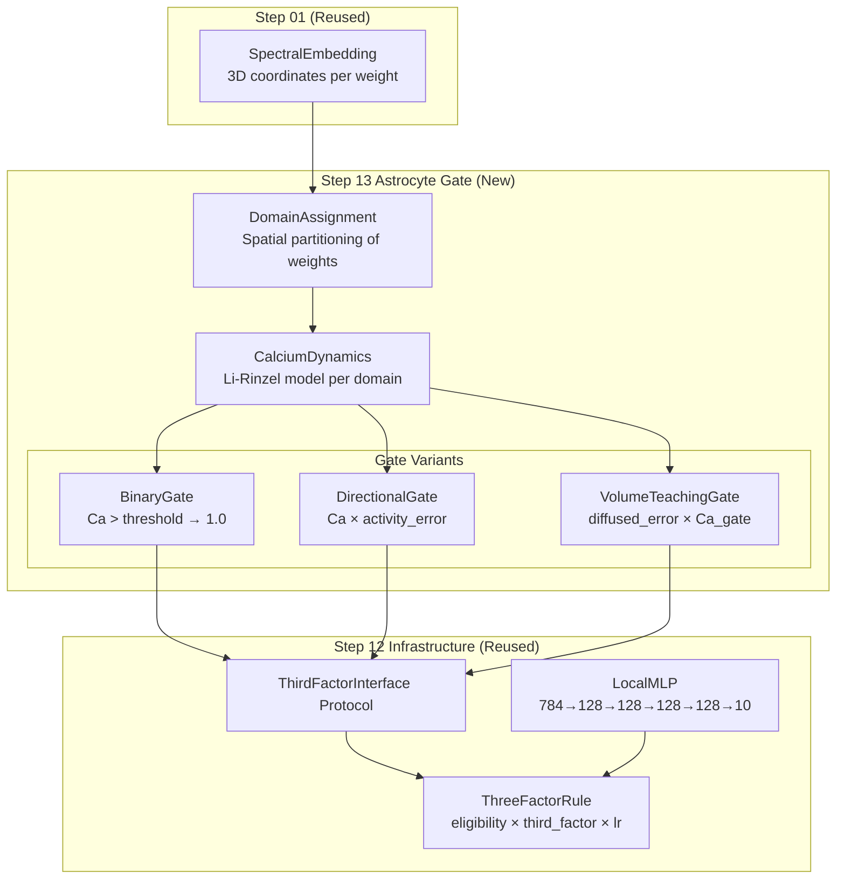
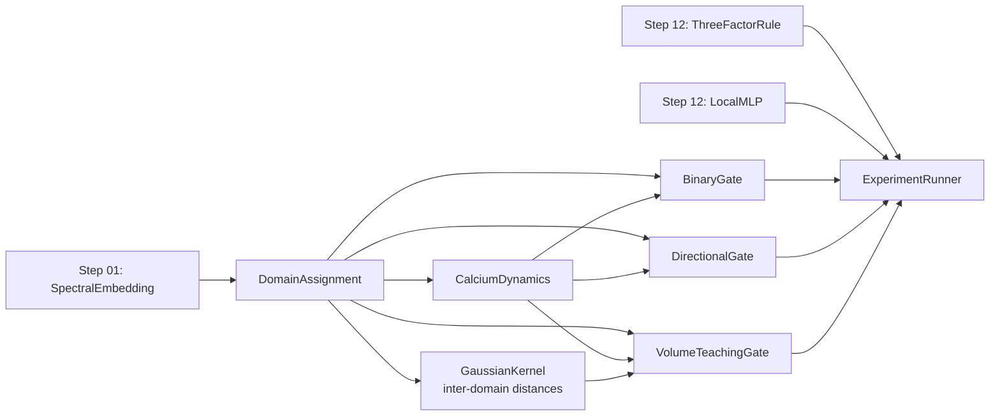

# Design Document: Astrocyte D-Serine Gating (Step 13)

## Overview

This design implements three variants of an astrocyte-derived gating signal as a drop-in replacement for Step 12's ThirdFactorInterface. The astrocyte gate transforms the three-factor learning rule from a weak local rule (10% accuracy, random chance) into a competitive algorithm by providing spatially-local directional credit assignment.

The core insight from Step 12: the three-factor rule with global reward already shows 104× stronger spatial correlation than backprop (−0.364 vs −0.003), confirming that spatial structure is meaningful under local rules. The astrocyte gate exploits this by partitioning weights into spatial domains and computing domain-local teaching signals derived from calcium dynamics and activity prediction errors.

**Architecture**: 784→128→128→128→128→10 (LocalMLP, detached forward)
**Dataset**: FashionMNIST, 50 epochs, 3 seeds
**Hardware**: MPS GPU on M4 Pro

### Gate Variants

| Variant | Signal Type | Shape | Credit Assignment |
|---------|------------|-------|-------------------|
| A (Binary) | 0.0 or 1.0 | (out_features,) | None — gates plasticity only |
| B (Directional) | signed float | (out_features,) | Activity prediction error per domain |
| C (Volume Teaching) | signed float | (out_features, in_features) | Spatially-diffused error from label targets |

### Design Rationale

Step 12 showed that the universal deficiency is credit assignment — local rules don't know WHICH direction to update weights. A binary gate (Variant A) serves as a control: it restricts WHERE learning happens but not HOW. Variant B adds direction via activity prediction error (novelty detection). Variant C goes further by computing a label-derived error and diffusing it spatially, approximating backprop's error delivery through volume transmission.

## Architecture



### Data Flow (per training step)

1. **Forward pass**: LocalMLP computes layer activations (detached between layers)
2. **Domain sensing**: Each astrocyte domain computes mean absolute activation from its governed weights' post-activations
3. **Calcium update**: Li-Rinzel dynamics evolve calcium state based on domain activity (IP3 production ∝ activity)
4. **Gate computation**: Variant-specific signal computed from calcium state + domain activity
5. **Three-factor update**: ThreeFactorRule applies `eligibility × gate_signal × lr` to weights

### Component Dependency Graph



## Components and Interfaces

### 1. CalciumDynamics

Implements the Li-Rinzel two-variable model vectorized over all astrocyte domains.

```python
class CalciumDynamics:
    """Li-Rinzel calcium dynamics vectorized over N domains.
    
    State variables (per domain):
        ca: cytoplasmic calcium concentration [Ca²⁺] (μM equivalent, [0, 10])
        h: IP3 receptor inactivation fraction (dimensionless, [0, 1])
    
    Fluxes:
        J_channel: IP3-dependent release from ER (CICR)
        J_pump: SERCA pump reuptake into ER
        J_leak: Passive ER leak
    """
    
    def __init__(
        self,
        n_domains: int,
        ip3_production_rate: float = 0.5,
        d_serine_threshold: float = 0.4,
        serca_pump_rate: float = 0.9,
        er_leak_rate: float = 0.02,
        ip3_receptor_d1: float = 0.13,  # IP3 dissociation constant
        ip3_receptor_d5: float = 0.08,  # Ca²⁺ inhibition constant
        dt: float = 0.01,               # Integration timestep
        ca_max: float = 10.0,           # Physiological maximum
        device: str = "cpu",
    ): ...
    
    def step(self, domain_activities: torch.Tensor) -> torch.Tensor:
        """Advance calcium dynamics by one timestep.
        
        Args:
            domain_activities: Mean absolute activation per domain (n_domains,)
            
        Returns:
            Calcium state tensor (n_domains,)
        """
        ...
    
    def get_calcium(self) -> torch.Tensor:
        """Current calcium concentration per domain (n_domains,)."""
        ...
    
    def get_gate_open(self) -> torch.Tensor:
        """Boolean mask: which domains have Ca > threshold (n_domains,)."""
        ...
    
    def reset(self) -> None:
        """Reset calcium and h to resting state."""
        ...
    
    def state_dict(self) -> dict:
        """Serialize state for checkpointing."""
        ...
    
    def load_state_dict(self, state: dict) -> None:
        """Restore state from checkpoint."""
        ...
```

**Li-Rinzel Equations** (vectorized):

```
IP3 = ip3_production_rate × domain_activity  (glutamate spillover analog)

m_inf = IP3 / (IP3 + d1)                     (IP3 activation)
n_inf = ca / (ca + d5)                        (Ca²⁺ activation)
h_inf = d2 / (d2 + ca)                        (steady-state inactivation)
tau_h = 1 / (a2 × (d2 + ca))                  (inactivation time constant)

J_channel = c1 × (m_inf × n_inf × h)³ × (c0 - (1+c1)×ca)  (ER release)
J_pump = serca_pump_rate × ca² / (K_pump² + ca²)            (SERCA uptake)
J_leak = er_leak_rate × (c0 - (1+c1)×ca)                    (passive leak)

dca/dt = J_channel - J_pump + J_leak
dh/dt = (h_inf - h) / tau_h

ca = clamp(ca + dca × dt, 0, ca_max)
h = clamp(h + dh × dt, 0, 1)
```

### 2. DomainAssignment

Partitions weights into astrocyte domains based on spatial proximity.

```python
class DomainAssignment:
    """Assigns weights to astrocyte domains based on spatial embedding.
    
    Each domain governs a contiguous region of the spatial embedding.
    All weights in a domain receive the same gating signal.
    """
    
    def __init__(
        self,
        layer_sizes: list[tuple[int, int]],  # [(in, out), ...] per layer
        domain_size: int = 16,                # weights per domain (output neurons)
        embedding_path: str | None = None,    # Path to Step 01 coordinates
        mode: str = "spatial",                # "spatial" or "random" (ablation)
        seed: int = 42,
    ): ...
    
    @property
    def n_domains_per_layer(self) -> list[int]:
        """Number of domains in each layer."""
        ...
    
    @property
    def total_domains(self) -> int:
        """Total domains across all layers."""
        ...
    
    def get_domain_indices(self, layer_index: int) -> list[list[int]]:
        """Return list of output neuron indices per domain for a layer.
        
        Returns:
            List of lists, where each inner list contains the output neuron
            indices belonging to that domain.
        """
        ...
    
    def get_domain_distances(self, layer_index: int) -> torch.Tensor:
        """Pairwise distances between domain centers for a layer.
        
        Returns:
            Distance matrix (n_domains, n_domains) for gap junction coupling
            and volume transmission.
        """
        ...
    
    def get_neuron_to_domain(self, layer_index: int) -> torch.Tensor:
        """Mapping from output neuron index to domain index.
        
        Returns:
            Tensor of shape (out_features,) with domain index per neuron.
        """
        ...
```

**Domain Assignment Algorithm**:
- For each layer with `out_features` output neurons, partition into `ceil(out_features / domain_size)` domains
- In "spatial" mode: use k-means clustering on the 3D coordinates of output neurons (from Step 01 spectral embedding) to form spatially coherent domains
- In "random" mode: randomly assign neurons to domains (for ablation)
- Fallback (no embedding available): contiguous index partitioning (neurons 0-15 → domain 0, 16-31 → domain 1, etc.)

### 3. BinaryGate (Variant A)

```python
class BinaryGate:
    """Binary astrocyte gate: plasticity on/off based on calcium threshold.
    
    Implements ThirdFactorInterface.
    Signal = 1.0 if domain calcium > threshold, else 0.0
    Shape: (out_features,) — same value for all weights of a neuron in a domain.
    """
    
    name = "binary_gate"
    
    def __init__(
        self,
        domain_assignment: DomainAssignment,
        calcium_dynamics: CalciumDynamics,
    ): ...
    
    def compute_signal(
        self,
        layer_activations: torch.Tensor,   # (batch, out_features)
        layer_index: int,
        labels: torch.Tensor | None = None,
        global_loss: float | None = None,
        prev_loss: float | None = None,
    ) -> torch.Tensor:
        """Compute binary gate signal.
        
        1. Compute mean absolute activation per domain
        2. Update calcium dynamics
        3. Return 1.0 for open domains, 0.0 for closed
        
        Returns:
            Gate tensor of shape (out_features,)
        """
        ...
    
    def reset(self) -> None:
        """Reset calcium state between epochs."""
        ...
```

### 4. DirectionalGate (Variant B)

```python
class DirectionalGate:
    """Directional astrocyte gate: calcium × activity prediction error.
    
    Implements ThirdFactorInterface.
    Signal = calcium_magnitude × normalized(current_activity - predicted_activity)
    Shape: (out_features,) — signed value per neuron.
    
    The activity prediction error provides directional credit assignment:
    - Positive: neuron is more active than expected → strengthen inputs
    - Negative: neuron is less active than expected → weaken inputs
    - Zero: neuron matches prediction → no learning needed
    """
    
    name = "directional_gate"
    
    def __init__(
        self,
        domain_assignment: DomainAssignment,
        calcium_dynamics: CalciumDynamics,
        prediction_decay: float = 0.95,  # EMA decay for activity prediction
    ): ...
    
    def compute_signal(
        self,
        layer_activations: torch.Tensor,   # (batch, out_features)
        layer_index: int,
        labels: torch.Tensor | None = None,
        global_loss: float | None = None,
        prev_loss: float | None = None,
    ) -> torch.Tensor:
        """Compute directional gate signal.
        
        1. Compute mean activation per domain (batch-averaged)
        2. Compute activity error = current - predicted
        3. Update prediction with EMA
        4. Normalize error per domain (zero-mean, unit-variance)
        5. Update calcium dynamics
        6. Return calcium_state × normalized_error (zero where Ca < threshold)
        
        Returns:
            Signed gate tensor of shape (out_features,)
        """
        ...
    
    def reset(self) -> None:
        """Reset calcium state and activity predictions between epochs."""
        ...
```

### 5. VolumeTeachingGate (Variant C)

```python
class VolumeTeachingGate:
    """Volume-transmitted teaching signal with spatial diffusion.
    
    Implements ThirdFactorInterface.
    Signal = sum_over_domains(error_source × gaussian_kernel(distance)) × calcium_gate
    Shape: (out_features,) — spatially-graded signed value per neuron.
    
    Each domain computes a local error (activity vs label-derived target),
    then this error diffuses to neighboring domains via Gaussian kernel
    weighted by spatial distance. The calcium gate determines which
    domains are receptive to the teaching signal.
    """
    
    name = "volume_teaching"
    
    def __init__(
        self,
        domain_assignment: DomainAssignment,
        calcium_dynamics: CalciumDynamics,
        diffusion_sigma: float | None = None,  # Default: mean inter-domain distance
        n_classes: int = 10,
        gap_junction_strength: float = 0.1,    # Calcium coupling between domains
    ): ...
    
    def compute_signal(
        self,
        layer_activations: torch.Tensor,   # (batch, out_features)
        layer_index: int,
        labels: torch.Tensor | None = None,
        global_loss: float | None = None,
        prev_loss: float | None = None,
    ) -> torch.Tensor:
        """Compute volume-transmitted teaching signal.
        
        1. Compute domain-local error: domain_activity - projected_label_target
        2. Build Gaussian diffusion kernel from inter-domain distances
        3. Diffuse error: received_signal = kernel @ source_errors
        4. Apply gap junction calcium coupling between adjacent domains
        5. Update calcium dynamics
        6. Gate: signal × (Ca > threshold)
        7. Expand domain signal to per-neuron
        
        Returns:
            Signed teaching tensor of shape (out_features,)
        """
        ...
    
    def reset(self) -> None:
        """Reset calcium, predictions, and diffusion state."""
        ...
```

### 6. ExperimentRunner

```python
class ExperimentRunner:
    """Orchestrates training and evaluation for all conditions.
    
    Reuses Step 12's infrastructure with extensions for:
    - Astrocyte state checkpointing
    - Gate statistics collection (fraction open, temporal autocorrelation)
    - Central prediction test computation
    """
    
    def __init__(
        self,
        conditions: list[ExperimentCondition],
        seeds: list[int] = [42, 123, 456],
        epochs: int = 50,
        batch_size: int = 128,
        checkpoint_interval: int = 10,
        results_dir: str = "steps/13-astrocyte-gating/results/",
        data_dir: str = "steps/13-astrocyte-gating/data/",
    ): ...
    
    def run_all(self) -> None:
        """Run all conditions across all seeds."""
        ...
    
    def run_condition(self, condition: ExperimentCondition, seed: int) -> dict:
        """Run a single condition with a single seed."""
        ...
    
    def compute_central_prediction(self, results: dict) -> dict:
        """Compute benefit_under_local vs benefit_under_backprop."""
        ...
    
    def generate_report(self, results: dict) -> None:
        """Generate summary markdown and visualizations."""
        ...
```

## Data Models

### Configuration

```python
@dataclass
class CalciumConfig:
    """Configuration for Li-Rinzel calcium dynamics."""
    ip3_production_rate: float = 0.5
    d_serine_threshold: float = 0.4
    serca_pump_rate: float = 0.9
    er_leak_rate: float = 0.02
    ip3_receptor_d1: float = 0.13
    ip3_receptor_d5: float = 0.08
    dt: float = 0.01
    ca_max: float = 10.0
    # Li-Rinzel constants
    c0: float = 2.0    # Total calcium (cytoplasm + ER)
    c1: float = 0.185  # ER/cytoplasm volume ratio
    a2: float = 0.2    # IP3R inactivation rate
    d2: float = 1.049  # Ca²⁺ inactivation dissociation constant
    K_pump: float = 0.1  # SERCA half-activation


@dataclass
class DomainConfig:
    """Configuration for astrocyte domain assignment."""
    domain_size: int = 16          # Output neurons per domain
    mode: str = "spatial"          # "spatial" or "random"
    embedding_path: str | None = None
    seed: int = 42


@dataclass
class GateConfig:
    """Configuration for gate variants."""
    variant: str = "directional"   # "binary", "directional", "volume_teaching"
    prediction_decay: float = 0.95  # EMA decay (Variant B)
    diffusion_sigma: float | None = None  # Gaussian width (Variant C)
    gap_junction_strength: float = 0.1    # Ca coupling (Variant C)
    n_classes: int = 10


@dataclass
class ExperimentCondition:
    """A single experimental condition to run."""
    name: str
    gate_config: GateConfig | None  # None for baselines
    calcium_config: CalciumConfig = field(default_factory=CalciumConfig)
    domain_config: DomainConfig = field(default_factory=DomainConfig)
    learning_rate: float = 0.01
    tau: float = 100.0
    use_stability_fix: bool = True
    error_clip_threshold: float = 10.0
    eligibility_norm_threshold: float = 100.0
```

### State Tensors (per layer)

| Tensor | Shape | Description |
|--------|-------|-------------|
| `calcium` | (n_domains,) | Cytoplasmic [Ca²⁺] per domain |
| `h` | (n_domains,) | IP3R inactivation variable per domain |
| `activity_prediction` | (n_domains,) | EMA of domain activity (Variant B) |
| `domain_indices` | list of (domain_size,) | Neuron indices per domain |
| `neuron_to_domain` | (out_features,) | Domain assignment per neuron |
| `domain_distances` | (n_domains, n_domains) | Pairwise spatial distances |
| `diffusion_kernel` | (n_domains, n_domains) | Precomputed Gaussian kernel (Variant C) |
| `label_projections` | (n_domains, n_classes) | Fixed random projections for target (Variant C) |

### Results Schema

```python
@dataclass
class EpochResult:
    """Results for a single epoch of a single condition/seed."""
    epoch: int
    train_loss: float
    test_accuracy: float
    weight_norms: list[float]       # Per-layer weight norms
    gate_fraction_open: float       # Fraction of domains with Ca > threshold
    gate_temporal_autocorr: float   # Temporal autocorrelation of gate signal
    spatial_correlation: float      # Correlation of updates with spatial distance


@dataclass
class ConditionResult:
    """Aggregated results for a condition across seeds."""
    condition_name: str
    mean_accuracy: float
    std_accuracy: float
    epoch_results: list[list[EpochResult]]  # [seed][epoch]
    central_prediction_benefit: float | None  # Only for gated conditions
```


## Correctness Properties

*A property is a characteristic or behavior that should hold true across all valid executions of a system — essentially, a formal statement about what the system should do. Properties serve as the bridge between human-readable specifications and machine-verifiable correctness guarantees.*

### Property 1: Sign-Preserving Error Clipping

*For any* error signal tensor with arbitrary values, clipping to a threshold T shall produce an output where (a) no element has absolute value exceeding T, and (b) the sign of every non-zero element is preserved from the original.

**Validates: Requirements 2.1, 2.4**

### Property 2: Eligibility Trace Norm Bounding

*For any* eligibility trace tensor whose Frobenius norm exceeds a threshold N, normalization shall produce a tensor with norm equal to the safe constant S, and the direction (unit vector) of the trace shall be preserved.

**Validates: Requirements 2.2**

### Property 3: Calcium Concentration Invariant

*For any* sequence of domain activity inputs (including extreme values 0, 1e6, negative values, NaN-free), after each Li-Rinzel dynamics step, the calcium concentration for every domain shall remain in the interval [0, ca_max] and the inactivation variable h shall remain in [0, 1].

**Validates: Requirements 3.6**

### Property 4: IP3 Proportionality

*For any* two domain activity levels a₁ and a₂ where a₁ > a₂ ≥ 0, the IP3 production for the domain with activity a₁ shall be greater than or equal to the IP3 production for the domain with activity a₂.

**Validates: Requirements 3.3**

### Property 5: Domain Partition Validity

*For any* layer with out_features neurons and domain_size configuration (in either "spatial" or "random" mode), the domain assignment shall produce exactly ceil(out_features / domain_size) domains where every neuron belongs to exactly one domain (no overlaps, no unassigned neurons).

**Validates: Requirements 4.1, 4.2, 4.3**

### Property 6: Domain Assignment Immutability

*For any* DomainAssignment instance, calling get_domain_indices(layer_index) multiple times shall return identical results, and the assignment shall not change after any number of gate computations.

**Validates: Requirements 4.4**

### Property 7: Binary Gate Threshold Semantics

*For any* calcium state across domains, the binary gate shall output exactly 1.0 for every neuron in a domain where calcium exceeds the D-serine threshold, and exactly 0.0 for every neuron in a domain where calcium is at or below the threshold. All neurons within the same domain shall receive the same gate value.

**Validates: Requirements 5.2, 5.4**

### Property 8: Binary Gate Blocks Closed-Domain Updates

*For any* layer state where some domains have calcium below threshold (gate = 0), the weight update produced by ThreeFactorRule with BinaryGate shall be exactly zero for all weights belonging to closed domains.

**Validates: Requirements 5.5**

### Property 9: Directional Gate EMA Dynamics

*For any* sequence of domain activities [a₁, a₂, ..., aₙ], the activity prediction after step k shall equal decay^k × initial_prediction + (1-decay) × Σᵢ₌₁ᵏ decay^(k-i) × aᵢ, matching the exponential moving average formula with the configured decay rate.

**Validates: Requirements 6.2**

### Property 10: Directional Gate Output Formula

*For any* domain with calcium state c, current activity a, and predicted activity p, the directional gate output shall equal c × normalize(a - p) when c > threshold, and exactly 0.0 when c ≤ threshold. The sign of the output shall match the sign of (a - p) for domains where calcium exceeds threshold.

**Validates: Requirements 6.3, 6.4, 6.5, 6.7**

### Property 11: Directional Gate Error Normalization

*For any* set of domain activity errors across a layer, after normalization the maximum absolute value of the error signal shall be bounded (preventing magnitude differences between domains from dominating the learning signal).

**Validates: Requirements 6.6**

### Property 12: Volume Teaching Gaussian Diffusion

*For any* set of source domain errors and pairwise domain distances, the received signal at each domain shall equal the sum of source errors weighted by exp(-d²/2σ²) where d is the spatial distance to each source. Consequently, for any two receiver domains at distances d₁ < d₂ from a single source, the closer domain shall receive a signal of greater or equal magnitude.

**Validates: Requirements 7.3, 7.4**

### Property 13: Volume Teaching Calcium Gating

*For any* diffused teaching signal, the final output shall be zero for all neurons in domains where calcium is below the D-serine release threshold, regardless of the magnitude of the diffused signal.

**Validates: Requirements 7.5**

### Property 14: Gap Junction Calcium Equilibration

*For any* pair of adjacent domains with different calcium concentrations, after gap junction coupling the calcium difference between them shall be reduced (diffusion toward equilibrium). The total calcium across all coupled domains shall be conserved (no calcium created or destroyed by coupling).

**Validates: Requirements 7.7**

### Property 15: Gate Output Shape Compatibility

*For any* gate variant (Binary, Directional, Volume Teaching) and any valid layer activation tensor of shape (batch, out_features), the compute_signal output shall have shape (out_features,) compatible with the ThreeFactorRule's per-output modulation logic.

**Validates: Requirements 8.2**

## Error Handling

### Numerical Stability

| Condition | Handling | Rationale |
|-----------|----------|-----------|
| Calcium exceeds ca_max | Clamp to ca_max | Li-Rinzel can produce runaway calcium without bounds |
| Calcium goes negative | Clamp to 0.0 | Numerical integration artifacts |
| h outside [0, 1] | Clamp to [0, 1] | Inactivation variable is a fraction |
| Error signal explosion | Clip to ±error_clip_threshold | Step 12 showed loss explosion with layer-wise error |
| Eligibility trace explosion | Normalize to safe_constant | Prevents weight explosion in deep layers |
| NaN in calcium dynamics | Reset domain to resting state, log warning | Graceful recovery from numerical issues |
| Division by zero in normalization | Add epsilon (1e-8) to denominators | Standard numerical safety |
| Gaussian kernel underflow | Clamp kernel values to minimum 1e-10 | Prevents log(0) in any downstream computation |

### Fallback Behaviors

| Condition | Fallback | Rationale |
|-----------|----------|-----------|
| Spatial embedding file not found | Contiguous index partitioning + warning | Experiment can still run without spatial structure |
| Domain size > out_features | Single domain per layer + warning | Degenerate but valid configuration |
| All domains closed (Ca < threshold everywhere) | Return zero signal (no learning this step) | Biologically correct — no D-serine means no plasticity |
| Labels not provided (unsupervised) | Volume teaching returns zero; directional gate still works | Directional gate uses activity prediction, not labels |
| prev_loss is None (first step) | Skip reward computation, return zero | No baseline available yet |

### Checkpointing and Recovery

- Checkpoint calcium state, h, activity predictions, and eligibility traces every 10 epochs
- On resume: load checkpoint and continue from saved state
- If checkpoint is corrupted: reset to initial state and log warning, restart from epoch 0

## Testing Strategy

### Property-Based Testing (Hypothesis)

Property-based tests validate the 15 correctness properties above using the `hypothesis` library (already used in this project — see `.hypothesis/` directory).

**Configuration**:
- Minimum 100 examples per property test
- Use `@settings(max_examples=200, deadline=None)` for calcium dynamics tests (MPS computation)
- Tag format: `# Feature: astrocyte-gating, Property {N}: {title}`

**Test Organization**:
```
steps/13-astrocyte-gating/code/tests/
├── test_calcium_dynamics.py      # Properties 3, 4
├── test_domain_assignment.py     # Properties 5, 6
├── test_binary_gate.py           # Properties 7, 8
├── test_directional_gate.py      # Properties 9, 10, 11
├── test_volume_teaching.py       # Properties 12, 13, 14
├── test_stability_fix.py         # Properties 1, 2
├── test_interface_compat.py      # Property 15
└── conftest.py                   # Shared fixtures and strategies
```

**Custom Hypothesis Strategies**:
- `domain_activities()`: Generates tensors of shape (n_domains,) with values in [0, 5]
- `layer_activations(out_features)`: Generates (batch, out_features) tensors
- `calcium_states(n_domains)`: Generates calcium values in [0, ca_max]
- `domain_configs()`: Generates valid DomainConfig with random sizes
- `error_tensors(shape)`: Generates tensors with values spanning [-1e6, 1e6]

### Unit Tests (Example-Based)

Unit tests cover specific examples, integration points, and edge cases:

- Li-Rinzel model produces expected oscillation pattern with sustained input
- Calcium rises from resting state with constant activity input
- Calcium decays back to resting state when activity stops
- Domain assignment with known embedding produces expected spatial clusters
- Binary gate transitions from closed to open as activity increases
- Directional gate sign flips when activity crosses prediction
- Volume teaching signal is strongest at source domain
- ThreeFactorRule + each gate variant produces valid weight updates
- Checkpoint save/load round-trip preserves all state

### Integration Tests

- Full 5-epoch training run with each gate variant (no NaN/Inf)
- Gate variants produce different accuracy trajectories (not all identical)
- Experiment runner generates all expected output files
- CLI argument parsing works for individual and batch conditions
- Results CSV has correct schema and no missing values

### Test Execution

```bash
# Run property tests only
pytest steps/13-astrocyte-gating/code/tests/ -m "property" --run

# Run all tests
pytest steps/13-astrocyte-gating/code/tests/ --run

# Run with verbose hypothesis output
pytest steps/13-astrocyte-gating/code/tests/ -m "property" --hypothesis-show-statistics --run
```
