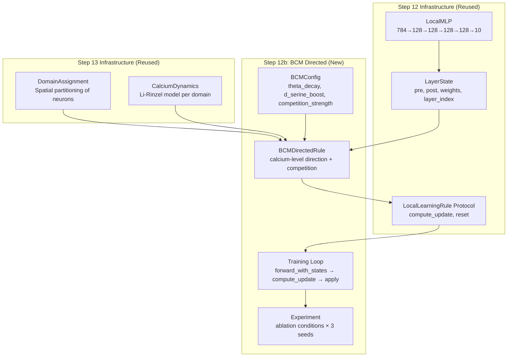
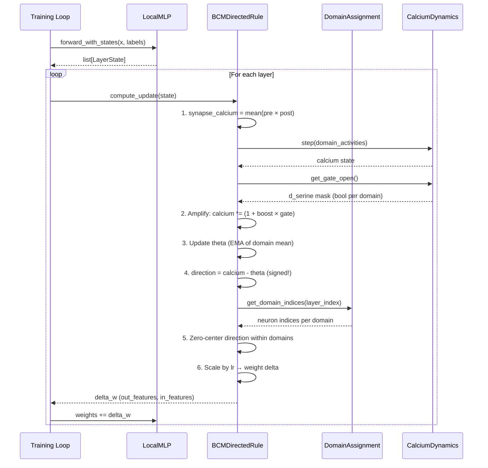

# Design Document: BCM-Directed Substrate (Step 12b)

## Overview

This design implements a biologically faithful local learning rule where **direction** (LTP vs LTD) comes from local calcium levels relative to a sliding threshold (BCM theory), with heterosynaptic competition within astrocyte domains providing local credit assignment.

Step 12 showed that local rules achieve only 10% (chance) because the eligibility trace (`pre × post`) is always positive under ReLU — it's undirected. Step 13's gates modulate magnitude but can't fix an undirected signal. The biological answer (from `substrate-analysis.md`) is that direction emerges from the **level** of postsynaptic calcium relative to a sliding threshold: above theta → LTP, below theta → LTD. The astrocyte's D-serine release gates whether synapses can reach the high-calcium state needed for LTP. Heterosynaptic competition (zero-centering within domains) provides local winner-take-all credit assignment.

The `BCMDirectedRule` implements the `LocalLearningRule` protocol from Step 12, reuses `DomainAssignment` and `CalciumDynamics` from Step 13, and integrates with the existing `LocalMLP` and training infrastructure.

## Architecture



### Data Flow (per training step)



### Directory Layout

```
steps/12b-bcm-directed/
├── README.md
├── docs/decisions.md
├── code/
│   ├── __init__.py
│   ├── bcm_rule.py          # BCMDirectedRule (core learning rule)
│   ├── bcm_config.py        # Configuration dataclass
│   ├── training.py          # Training loop (reuses Step 12 pattern)
│   ├── experiment.py        # Comparison experiment with ablations
│   ├── scripts/
│   │   ├── run_experiment.py
│   │   └── run_quick.py
│   └── tests/
│       ├── __init__.py
│       ├── conftest.py
│       └── test_bcm_rule.py
├── data/
└── results/
```

## Components and Interfaces

### 1. BCMDirectedRule

The core learning rule. Implements `LocalLearningRule` protocol.

```python
class BCMDirectedRule:
    """BCM-based directed local learning rule.

    Direction comes from postsynaptic calcium level relative to a
    sliding threshold (BCM theory). The astrocyte D-serine gate
    determines whether high calcium (LTP) is achievable.
    Heterosynaptic competition zero-centers updates within domains.

    Implements LocalLearningRule protocol (compute_update, reset).
    """

    name = "bcm_directed"

    def __init__(
        self,
        domain_assignment: DomainAssignment,
        calcium_dynamics: dict[int, CalciumDynamics],  # Per-layer
        lr: float = 0.01,
        theta_decay: float = 0.99,
        d_serine_boost: float = 1.0,
        competition_strength: float = 1.0,
    ):
        self.domain_assignment = domain_assignment
        self.calcium_dynamics = calcium_dynamics
        self.lr = lr
        self.theta_decay = theta_decay
        self.d_serine_boost = d_serine_boost
        self.competition_strength = competition_strength
        # Sliding threshold per layer, per domain
        self._theta: dict[int, torch.Tensor] = {}

    def compute_update(self, state: LayerState) -> torch.Tensor:
        """Compute BCM-directed weight update.

        Returns:
            Weight delta of shape (out_features, in_features).
        """
        ...

    def reset(self) -> None:
        """Reset sliding thresholds."""
        self._theta.clear()
```

**Responsibilities**:
- Compute per-neuron "synapse calcium" from pre/post activations
- Query CalciumDynamics for D-serine gate state
- Maintain and update sliding threshold theta per domain
- Apply heterosynaptic competition (zero-centering within domains)
- Return signed weight delta compatible with training loop

### 2. BCMConfig

```python
@dataclass
class BCMConfig:
    """Configuration for BCMDirectedRule."""
    lr: float = 0.01
    theta_decay: float = 0.99         # EMA decay for sliding threshold
    theta_init: float = 0.1           # Initial theta value
    d_serine_boost: float = 1.0       # Multiplicative calcium amplification
    competition_strength: float = 1.0  # 0 = no competition, 1 = full zero-centering
    clip_delta: float = 1.0           # Max norm of weight delta per layer
    use_d_serine: bool = True         # Ablation: disable D-serine gating
    use_competition: bool = True      # Ablation: disable heterosynaptic competition
```

### 3. Training Loop

Reuses the Step 12 pattern: `forward_with_states` → per-layer `compute_update` → apply delta.

```python
def train_epoch(
    model: LocalMLP,
    rule: BCMDirectedRule,
    train_loader: DataLoader,
    device: str = "cpu",
) -> float:
    """Train one epoch using BCM directed rule.

    For each batch:
      1. Forward pass with states (detached between layers)
      2. Compute cross-entropy loss (for monitoring only, not for learning)
      3. For each layer: compute_update → apply to weights
      4. Step calcium dynamics with domain activities

    Returns:
        Mean training loss for the epoch.
    """
    ...
```

### 4. Experiment Runner

```python
@dataclass
class ExperimentCondition:
    """A single experimental condition."""
    name: str
    bcm_config: BCMConfig
    calcium_config: CalciumConfig
    domain_config: DomainConfig

# Conditions:
# 1. "bcm_no_astrocyte"     — BCM direction only, no D-serine, no competition
# 2. "bcm_d_serine"         — BCM + D-serine boost, no competition
# 3. "bcm_full"             — BCM + D-serine + heterosynaptic competition
# 4. "three_factor_reward"  — Step 12 baseline (for reference)
# 5. "backprop"             — Upper bound
```

## Data Models

### State Tensors (per layer, maintained by BCMDirectedRule)

| Tensor | Shape | Description |
|--------|-------|-------------|
| `theta` | (n_domains,) | Sliding BCM threshold per domain |
| `synapse_calcium` | (out_features,) | Per-neuron calcium level (transient, per step) |
| `direction` | (out_features,) | Signed direction signal after theta subtraction |
| `domain_activities` | (n_domains,) | Mean activation per domain (drives CalciumDynamics) |

### Reused from Step 13

| Component | What's Reused |
|-----------|---------------|
| `CalciumDynamics` | Li-Rinzel model, `step()`, `get_gate_open()` |
| `CalciumConfig` | All parameters (ip3_production_rate, d_serine_threshold, etc.) |
| `DomainAssignment` | `get_domain_indices()`, `get_neuron_to_domain()`, `n_domains_per_layer` |
| `DomainConfig` | domain_size, mode, seed |

### Reused from Step 12

| Component | What's Reused |
|-----------|---------------|
| `LocalMLP` | Network architecture, `forward_with_states()` |
| `LayerState` | Data structure for rule input |
| `LocalLearningRule` | Protocol interface |
| Data loading | `get_fashion_mnist_loaders()` |

## Key Functions with Formal Specifications

### Function 1: `compute_update(state: LayerState) -> Tensor`

```python
def compute_update(self, state: LayerState) -> torch.Tensor:
    """Compute BCM-directed weight update for one layer.

    Algorithm:
        1. synapse_calcium = mean_over_batch(|post|) per output neuron
        2. domain_activities = mean(synapse_calcium) per domain
        3. Step calcium dynamics with domain_activities
        4. gate_open = calcium_dynamics.get_gate_open() (bool per domain)
        5. Amplify: synapse_calcium *= (1 + d_serine_boost * gate_open[neuron_domain])
        6. Update theta: theta = theta_decay * theta + (1 - theta_decay) * domain_activities
        7. direction = synapse_calcium - theta[neuron_domain]  (SIGNED)
        8. Heterosynaptic competition: for each domain, direction -= domain_mean(direction)
        9. weight_delta = lr * outer(direction, mean_pre)
       10. Clip weight_delta norm to clip_delta

    Returns:
        Weight delta of shape (out_features, in_features).
    """
```

**Preconditions:**
- `state.pre_activation` has shape `(batch_size, in_features)` with `batch_size >= 1`
- `state.post_activation` has shape `(batch_size, out_features)`
- `state.weights` has shape `(out_features, in_features)`
- `state.layer_index` is a valid layer index (0 to n_layers-1)
- `self.calcium_dynamics[state.layer_index]` exists and is initialized

**Postconditions:**
- Returns tensor of shape `(out_features, in_features)` matching `state.weights`
- Return value contains both positive and negative entries (direction is signed)
- If `use_competition=True`: mean of direction within each domain is approximately zero
- If `use_d_serine=False`: no amplification applied (calcium = raw activity)
- Frobenius norm of return value ≤ `clip_delta`
- `self._theta[layer_index]` is updated (moved toward domain mean activity)

**Loop Invariants:**
- For the domain iteration in step 8: all previously processed domains have zero-mean direction
- Theta remains non-negative after each update (activities are non-negative, EMA preserves sign)

### Function 2: `_compute_synapse_calcium(state: LayerState) -> Tensor`

```python
def _compute_synapse_calcium(self, state: LayerState) -> torch.Tensor:
    """Compute per-neuron synapse calcium from activations.

    synapse_calcium[j] = mean_over_batch(|post[j]|)

    This represents the postsynaptic calcium level at neuron j,
    driven by how strongly the neuron fires (post-activation magnitude).
    """
```

**Preconditions:**
- `state.post_activation` has shape `(batch_size, out_features)` with finite values

**Postconditions:**
- Returns tensor of shape `(out_features,)`
- All values are non-negative (absolute value + mean)
- Values are bounded by max(|post_activation|)

### Function 3: `_apply_d_serine_boost(calcium: Tensor, layer_index: int) -> Tensor`

```python
def _apply_d_serine_boost(
    self, calcium: torch.Tensor, layer_index: int
) -> torch.Tensor:
    """Amplify calcium for neurons in domains where D-serine is available.

    For neurons in open domains: calcium *= (1 + d_serine_boost)
    For neurons in closed domains: calcium unchanged

    The astrocyte enables LTP by releasing D-serine when its own
    calcium exceeds threshold. Without D-serine, synapses can't
    reach high calcium → biased toward LTD.
    """
```

**Preconditions:**
- `calcium` has shape `(out_features,)` with non-negative values
- `self.calcium_dynamics[layer_index]` has been stepped this iteration

**Postconditions:**
- Returns tensor of shape `(out_features,)`
- For neurons in open domains: `result[i] = calcium[i] * (1 + d_serine_boost)` > `calcium[i]`
- For neurons in closed domains: `result[i] = calcium[i]` (unchanged)
- All values remain non-negative

### Function 4: `_update_theta(domain_activities: Tensor, layer_index: int) -> None`

```python
def _update_theta(
    self, domain_activities: torch.Tensor, layer_index: int
) -> None:
    """Update sliding BCM threshold with EMA of domain mean activity.

    theta = theta_decay * theta + (1 - theta_decay) * domain_activities

    The threshold slides toward the mean activity level. This is the
    BCM homeostasis mechanism: if a domain is very active, theta rises,
    making LTP harder (preventing runaway potentiation).
    """
```

**Preconditions:**
- `domain_activities` has shape `(n_domains,)` with non-negative values
- `theta_decay` ∈ (0, 1)

**Postconditions:**
- `self._theta[layer_index]` is updated in-place
- New theta is a convex combination of old theta and domain_activities
- If domain_activities > old_theta: theta increases (LTP becomes harder)
- If domain_activities < old_theta: theta decreases (LTP becomes easier)
- Theta remains non-negative

### Function 5: `_apply_heterosynaptic_competition(direction: Tensor, layer_index: int) -> Tensor`

```python
def _apply_heterosynaptic_competition(
    self, direction: torch.Tensor, layer_index: int
) -> torch.Tensor:
    """Zero-center direction within each astrocyte domain.

    For each domain: direction[neurons_in_domain] -= mean(direction[neurons_in_domain])

    This creates local competition: within a domain, the most active
    neurons get positive direction (LTP) and the least active get
    negative direction (LTD). The domain as a whole doesn't drift.
    """
```

**Preconditions:**
- `direction` has shape `(out_features,)` with finite values
- Domain assignment covers all neurons (no unassigned)

**Postconditions:**
- Returns tensor of shape `(out_features,)`
- For each domain d: `mean(result[neurons_in_d])` ≈ 0 (within float precision)
- The relative ordering within each domain is preserved
- If `competition_strength < 1.0`: partial zero-centering (interpolation)

**Loop Invariants:**
- After processing domain k: domains 0..k all have approximately zero mean

## Algorithmic Pseudocode

### Main Algorithm: compute_update

```python
def compute_update(self, state: LayerState) -> torch.Tensor:
    layer_idx = state.layer_index
    device = state.weights.device
    out_features, in_features = state.weights.shape

    # 1. Compute per-neuron "synapse calcium" (how active is each output neuron)
    synapse_calcium = state.post_activation.abs().mean(dim=0)  # (out_features,)

    # 2. Compute domain-level activities (for calcium dynamics + theta)
    domain_indices = self.domain_assignment.get_domain_indices(layer_idx)
    n_domains = len(domain_indices)
    domain_activities = torch.zeros(n_domains, device=device)
    for d_idx, indices in enumerate(domain_indices):
        if indices:
            idx_t = torch.tensor(indices, device=device, dtype=torch.long)
            domain_activities[d_idx] = synapse_calcium[idx_t].mean()

    # 3. Step calcium dynamics (drives D-serine gate)
    calcium = self.calcium_dynamics[layer_idx]
    calcium.step(domain_activities)

    # 4. Apply D-serine boost (amplify calcium in open domains)
    if self.use_d_serine:
        gate_open = calcium.get_gate_open()  # (n_domains,) bool
        neuron_to_domain = self.domain_assignment.get_neuron_to_domain(layer_idx)
        neuron_to_domain = neuron_to_domain.to(device)
        neuron_gate = gate_open.float()[neuron_to_domain]  # (out_features,)
        synapse_calcium = synapse_calcium * (1.0 + self.d_serine_boost * neuron_gate)

    # 5. Update sliding threshold theta (BCM homeostasis)
    if layer_idx not in self._theta:
        self._theta[layer_idx] = torch.full(
            (n_domains,), self.theta_init, device=device
        )
    self._theta[layer_idx] = (
        self.theta_decay * self._theta[layer_idx]
        + (1 - self.theta_decay) * domain_activities
    )

    # 6. Compute direction = synapse_calcium - theta (SIGNED!)
    neuron_to_domain = self.domain_assignment.get_neuron_to_domain(layer_idx).to(device)
    neuron_theta = self._theta[layer_idx][neuron_to_domain]  # (out_features,)
    direction = synapse_calcium - neuron_theta  # SIGNED: positive=LTP, negative=LTD

    # 7. Heterosynaptic competition: zero-center within domains
    if self.use_competition:
        for d_idx, indices in enumerate(domain_indices):
            if len(indices) > 1:
                idx_t = torch.tensor(indices, device=device, dtype=torch.long)
                domain_mean = direction[idx_t].mean()
                direction[idx_t] -= self.competition_strength * domain_mean

    # 8. Compute weight delta: outer(direction, mean_pre)
    mean_pre = state.pre_activation.mean(dim=0)  # (in_features,)
    delta_w = self.lr * torch.outer(direction, mean_pre)  # (out, in)

    # 9. Clip to prevent explosion
    delta_norm = delta_w.norm()
    if delta_norm > self.clip_delta:
        delta_w = delta_w * (self.clip_delta / delta_norm)

    return delta_w
```

## Example Usage

```python
import torch
from steps.twelve_b.code.bcm_rule import BCMDirectedRule
from steps.twelve_b.code.bcm_config import BCMConfig
from steps.thirteen.code.calcium.li_rinzel import CalciumDynamics
from steps.thirteen.code.calcium.config import CalciumConfig
from steps.thirteen.code.domains.assignment import DomainAssignment
from steps.thirteen.code.domains.config import DomainConfig
from steps.twelve.code.network.local_mlp import LocalMLP

# Setup
layer_sizes = [(784, 128), (128, 128), (128, 128), (128, 128), (128, 10)]
domain_assignment = DomainAssignment(layer_sizes, DomainConfig(domain_size=16))

calcium_dynamics = {}
for layer_idx, n_domains in enumerate(domain_assignment.n_domains_per_layer):
    calcium_dynamics[layer_idx] = CalciumDynamics(n_domains=n_domains)

bcm_config = BCMConfig(lr=0.01, d_serine_boost=1.0, competition_strength=1.0)
rule = BCMDirectedRule(
    domain_assignment=domain_assignment,
    calcium_dynamics=calcium_dynamics,
    lr=bcm_config.lr,
    theta_decay=bcm_config.theta_decay,
    d_serine_boost=bcm_config.d_serine_boost,
    competition_strength=bcm_config.competition_strength,
)

# Training step
model = LocalMLP()
x = torch.randn(128, 784)
labels = torch.randint(0, 10, (128,))
states = model.forward_with_states(x, labels)

for state in states:
    delta_w = rule.compute_update(state)
    state.weights.add_(delta_w)
    # delta_w has both positive and negative values!
    print(f"Layer {state.layer_index}: "
          f"pos={(delta_w > 0).sum()}, neg={(delta_w < 0).sum()}")
```

## Correctness Properties

### Property 1: BCM Direction is Signed

*For any* valid LayerState with non-zero post-activations and a theta value that is neither zero nor equal to the mean synapse calcium, the direction tensor produced by `compute_update` SHALL contain both positive and negative values. Specifically, neurons with synapse calcium above their domain's theta get positive direction, and neurons below theta get negative direction.

**Validates: Requirements 1.2, 1.3, 1.4**

### Property 2: Theta Slides Toward Domain Mean Activity

*For any* sequence of domain activities `[a₁, a₂, ..., aₙ]` and initial theta `θ₀`, after N steps the theta SHALL equal `θ₀ × decay^N + (1-decay) × Σᵢ₌₁ᴺ decay^(N-i) × aᵢ`, matching the EMA formula. Furthermore, if domain activity is constant at value `a`, theta SHALL converge to `a` as N → ∞.

**Validates: Requirements 2.1, 2.2, 2.3, 2.4**

### Property 3: D-Serine Amplifies Calcium

*For any* neuron in a domain where `get_gate_open()` returns True, the synapse calcium after D-serine boost SHALL be strictly greater than before boost (by factor `1 + d_serine_boost`). For neurons in closed domains, calcium SHALL be unchanged.

**Validates: Requirements 3.1, 3.2**

### Property 4: Heterosynaptic Zero-Centering

*For any* direction tensor and domain assignment where each domain has ≥ 2 neurons, after applying heterosynaptic competition with `competition_strength=1.0`, the mean direction within each domain SHALL be approximately zero (within floating-point tolerance of 1e-6).

**Validates: Requirements 4.1**

### Property 5: Domain Partition Completeness

*For any* layer with `out_features` neurons and `domain_size` configuration, the domain assignment SHALL produce exactly `ceil(out_features / domain_size)` domains where every neuron belongs to exactly one domain (no overlaps, no unassigned neurons).

**Validates: Requirements 10.1, 10.2, 10.3**

### Property 6: Output Shape Matches Weight Shape

*For any* valid LayerState with weights of shape `(out_features, in_features)`, `compute_update(state)` SHALL return a tensor of exactly shape `(out_features, in_features)`.

**Validates: Requirements 5.1, 5.2**

### Property 7: Delta Norm Bounded

*For any* valid LayerState (including extreme activation values), the Frobenius norm of the returned weight delta SHALL not exceed `clip_delta`.

**Validates: Requirements 6.1**

### Property 8: Competition Preserves Relative Order

*For any* direction tensor within a single domain, after zero-centering, the relative ordering of neurons (which has highest direction, which has lowest) SHALL be preserved. The neuron with the highest pre-competition direction SHALL still have the highest post-competition direction.

**Validates: Requirements 4.2**

### Property 9: Ablation Independence

*For any* LayerState, when `use_d_serine=False` and `use_competition=False`, the output SHALL depend only on `post_activation`, `pre_activation`, `theta_decay`, and `lr` — not on calcium dynamics state or domain structure (beyond theta tracking).

**Validates: Requirements 9.1, 9.2, 9.3**

### Property 10: Calcium Dynamics Bounded

*For any* sequence of domain activities (including extreme values), after each `CalciumDynamics.step()`, calcium SHALL remain in `[0, ca_max]` and h SHALL remain in `[0, 1]`.

**Validates: Requirements 6.4**

## Error Handling

### Numerical Stability

| Condition | Handling | Rationale |
|-----------|----------|-----------|
| Weight delta norm > clip_delta | Normalize to clip_delta | Prevents weight explosion |
| Theta goes negative | Clamp to 0 | Activities are non-negative, but float errors possible |
| Empty domain (0 neurons) | Skip domain in competition | Degenerate config, shouldn't crash |
| NaN in synapse_calcium | Replace with 0, log warning | Graceful degradation |
| All neurons in domain have same calcium | Direction = 0 after competition | Correct: no information → no update |

### Fallback Behaviors

| Condition | Fallback | Rationale |
|-----------|----------|-----------|
| CalciumDynamics not initialized for layer | Initialize on first call | Lazy initialization |
| Theta not initialized for layer | Initialize to theta_init | First-step bootstrap |
| Domain with single neuron | Skip competition for that domain | Can't zero-center a single value |
| batch_size = 1 | Still works (mean over batch of 1) | No special handling needed |

## Testing Strategy

### Property-Based Testing (Hypothesis)

Property-based tests validate the 10 correctness properties using `hypothesis`.

**Configuration**:
- Minimum 100 examples per property test
- `@settings(max_examples=200, deadline=None)`
- Tag format: `# Feature: bcm-directed-substrate, Property {N}: {title}`

**Test File**: `steps/12b-bcm-directed/code/tests/test_bcm_rule.py`

**Custom Hypothesis Strategies**:
- `layer_states(out_features, in_features)`: Generates valid LayerState objects
- `domain_configs()`: Generates valid DomainConfig with various sizes
- `bcm_configs()`: Generates BCMConfig with parameter ranges
- `activity_tensors(shape)`: Generates non-negative activation tensors

### Unit Tests (Example-Based)

- BCM rule produces positive updates for high-activity neurons (above theta)
- BCM rule produces negative updates for low-activity neurons (below theta)
- D-serine boost increases calcium by expected factor
- Competition makes domain mean approximately zero
- Theta converges to constant activity level over many steps
- Full training step doesn't produce NaN/Inf
- Rule integrates with LocalMLP.forward_with_states()
- Reset clears theta state

### Integration Tests

- 5-epoch training run produces no NaN/Inf
- BCM directed achieves > 10% accuracy (better than undirected chance)
- Ablation: removing D-serine reduces accuracy
- Ablation: removing competition reduces accuracy
- All experiment conditions run without error

### Test Execution

```bash
# Run property tests
pytest steps/12b-bcm-directed/code/tests/ -m "property" --run

# Run all tests
pytest steps/12b-bcm-directed/code/tests/ --run
```

## Performance Considerations

- **Per-step overhead**: One `CalciumDynamics.step()` per layer (vectorized over domains, ~8 domains per layer) — negligible vs forward pass
- **Domain iteration**: Python loop over domains for competition. With 8 domains per layer and 5 layers, this is 40 iterations — acceptable for research code
- **Memory**: Theta storage is (n_domains,) per layer ≈ 40 floats total — negligible
- **Bottleneck**: The forward pass and outer product computation dominate, same as Step 12

## Dependencies

| Dependency | Source | What's Used |
|------------|--------|-------------|
| `CalciumDynamics` | `steps/13-astrocyte-gating/code/calcium/li_rinzel.py` | `step()`, `get_gate_open()`, `reset()` |
| `CalciumConfig` | `steps/13-astrocyte-gating/code/calcium/config.py` | Parameter defaults |
| `DomainAssignment` | `steps/13-astrocyte-gating/code/domains/assignment.py` | `get_domain_indices()`, `get_neuron_to_domain()` |
| `DomainConfig` | `steps/13-astrocyte-gating/code/domains/config.py` | `domain_size`, `mode` |
| `LocalMLP` | `steps/12-local-learning-rules/code/network/local_mlp.py` | `forward_with_states()` |
| `LayerState` | `steps/12-local-learning-rules/code/rules/base.py` | Input data structure |
| `LocalLearningRule` | `steps/12-local-learning-rules/code/rules/base.py` | Protocol interface |
| `torch` | PyPI | Tensor operations |
| `hypothesis` | PyPI | Property-based testing |
| `torchvision` | PyPI | FashionMNIST data |
