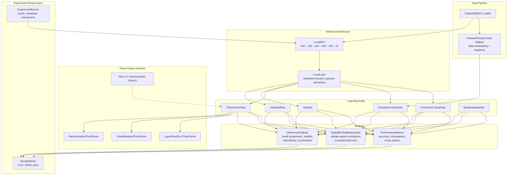

# Design Document: Local Learning Rules (Step 12)

## Overview

This design implements Step 12 of the glia-augmented neural network research plan: implementing five local learning rules WITHOUT glia to establish baselines for Step 13 (astrocyte gating). The core question is: how much performance do we lose by restricting weight updates to use only locally available information?

Phase 1 showed that spatial structure provides only weak regularization under backpropagation. Phase 2 tests the prediction that spatial structure WILL matter under local learning rules because the glial "third factor" signal must be spatially local. Step 12 establishes the baselines; Step 13 adds the astrocyte gate.

### Key Design Decisions

1. **Pluggable rule interface via Protocol**: All learning rules implement a `LocalLearningRule` protocol with `compute_update(layer_state) -> weight_delta`. This enables clean composition with the local layer architecture and future astrocyte gating.

2. **Detached forward pass**: The `LocalMLP` wraps the same 784→128→128→128→128→10 architecture but detaches activations between layers during training. Each layer sees its input as a fixed tensor (no gradient flows backward through the network). This enforces locality without modifying PyTorch's autograd.

3. **Three-factor interface designed for Step 13**: The `ThirdFactorInterface` protocol accepts layer activations, layer index, and global context (labels, loss), returning a modulation signal. Step 12 provides three placeholder implementations; Step 13 will provide the astrocyte gate as a drop-in replacement.

4. **Forward-forward uses per-layer optimizers**: Each layer has its own Adam optimizer that only sees that layer's parameters. The per-layer loss (goodness-based) is computed and backpropagated within a single layer — this is still "local" because the gradient never crosses layer boundaries.

5. **Predictive coding uses inference iterations**: Before each weight update, the network runs T inference iterations where representations are updated to minimize prediction error. This is the mechanism by which predictive coding approximates backpropagation using only local computations.

6. **Deficiency analysis via parallel backprop**: To measure credit assignment reach, we run a standard backprop pass on the same batch (without updating weights) and correlate the true gradient with each rule's local update signal. This quantifies how much error information each rule delivers to early layers.

7. **Reuse Phase 1 infrastructure**: Data loading (adapted for FashionMNIST), experiment runner pattern (seed management, metadata logging), spectral embedding (for spatial quality check), and the DeeperMLP architecture definition are reused from `steps/01-spatial-embedding/` and `steps/01-spatial-embedding-v2/`.

## Architecture



### Directory Layout

```
steps/12-local-learning-rules/
├── README.md
├── docs/
│   └── decisions.md
├── code/
│   ├── __init__.py
│   ├── rules/
│   │   ├── __init__.py
│   │   ├── base.py              # LocalLearningRule protocol
│   │   ├── hebbian.py           # HebbianRule
│   │   ├── oja.py               # OjaRule
│   │   ├── three_factor.py      # ThreeFactorRule + ThirdFactorInterface
│   │   ├── forward_forward.py   # ForwardForwardRule
│   │   └── predictive_coding.py # PredictiveCodingRule
│   ├── network/
│   │   ├── __init__.py
│   │   ├── local_mlp.py         # LocalMLP (detached forward)
│   │   └── local_layer.py       # LocalLayer (exposes activations)
│   ├── experiment/
│   │   ├── __init__.py
│   │   ├── runner.py            # ExperimentRunner (adapted from Phase 1)
│   │   ├── metrics.py           # PerformanceMetrics, linear probes
│   │   ├── deficiency.py        # DeficiencyAnalysis
│   │   ├── spatial_quality.py   # Spatial embedding quality under local rules
│   │   └── comparison.py        # Multi-rule comparison orchestration
│   ├── data/
│   │   ├── __init__.py
│   │   └── fashion_mnist.py     # FashionMNIST loader + FF adapter
│   └── tests/
│       ├── __init__.py
│       ├── test_rule_properties.py   # Property-based tests
│       ├── test_network.py           # LocalMLP/LocalLayer unit tests
│       └── test_integration.py       # End-to-end training tests
├── data/
│   └── (checkpoints, cached data)
└── results/
    └── (CSV, JSON, plots, summary.md)
```

## Components and Interfaces

### Core Protocol: LocalLearningRule

```python
from typing import Protocol
from dataclasses import dataclass
import torch


@dataclass
class LayerState:
    """All information available to a local learning rule at one layer."""
    pre_activation: torch.Tensor    # Input to the layer (batch_size, in_features)
    post_activation: torch.Tensor   # Output after activation fn (batch_size, out_features)
    weights: torch.Tensor           # Current weight matrix (out_features, in_features)
    bias: torch.Tensor | None       # Current bias vector (out_features,) or None
    layer_index: int                 # Position in the network (0-indexed)
    labels: torch.Tensor | None     # Batch labels (for rules that use them)
    global_loss: float | None       # Current batch loss (for reward-based rules)


class LocalLearningRule(Protocol):
    """Contract for all local learning rules.
    
    A local rule computes weight updates using only information
    available at the layer (no backward gradient flow through the network).
    """

    @property
    def name(self) -> str:
        """Human-readable name for results reporting."""
        ...

    def compute_update(self, state: LayerState) -> torch.Tensor:
        """Compute the weight update for this layer.
        
        Args:
            state: All locally available information at this layer.
            
        Returns:
            Weight delta tensor of same shape as state.weights.
            The caller applies: weights += delta.
        """
        ...

    def reset(self) -> None:
        """Reset any internal state (e.g., eligibility traces) between epochs."""
        ...
```

### ThirdFactorInterface

```python
class ThirdFactorInterface(Protocol):
    """Pluggable interface for the third factor signal in three-factor learning.
    
    Step 12 provides three placeholder implementations.
    Step 13 will provide AstrocyteGate as a drop-in replacement.
    """

    @property
    def name(self) -> str:
        """Identifier for this third factor source."""
        ...

    def compute_signal(
        self,
        layer_activations: torch.Tensor,
        layer_index: int,
        labels: torch.Tensor | None = None,
        global_loss: float | None = None,
        prev_loss: float | None = None,
    ) -> torch.Tensor:
        """Compute the third factor modulation signal.
        
        Args:
            layer_activations: Post-activation output of the layer (batch, out_features).
            layer_index: Which layer this is (0-indexed).
            labels: Ground truth labels for the batch.
            global_loss: Current batch loss value.
            prev_loss: Previous batch loss value (for reward computation).
            
        Returns:
            Modulation signal — either:
            - Scalar tensor (broadcast to all weights)
            - Tensor of shape (out_features,) (per-neuron modulation)
            - Tensor of shape (out_features, in_features) (per-weight modulation)
        """
        ...


class RandomNoiseThirdFactor:
    """Third factor = random noise ~ N(0, σ²). Lower bound baseline."""
    name = "random_noise"

    def __init__(self, sigma: float = 0.1):
        self.sigma = sigma

    def compute_signal(self, layer_activations, layer_index, **kwargs) -> torch.Tensor:
        """Return random noise of shape (out_features,)."""
        ...


class GlobalRewardThirdFactor:
    """Third factor = scalar reward based on loss improvement."""
    name = "global_reward"

    def __init__(self, baseline_decay: float = 0.99):
        self.baseline_decay = baseline_decay
        self.running_baseline: float = 0.0

    def compute_signal(self, layer_activations, layer_index, **kwargs) -> torch.Tensor:
        """Return scalar reward = (prev_loss - global_loss) - baseline."""
        ...


class LayerWiseErrorThirdFactor:
    """Third factor = local error signal per layer (approximates backprop)."""
    name = "layer_wise_error"

    def __init__(self, n_classes: int = 10):
        self.n_classes = n_classes
        self.layer_targets: dict[int, torch.Tensor] = {}

    def compute_signal(self, layer_activations, layer_index, **kwargs) -> torch.Tensor:
        """Compute local error by comparing activations to a local target.
        
        For the output layer: target = one-hot label.
        For hidden layers: target = random projection of label one-hot
        (provides directional signal without backprop).
        """
        ...
```

### LocalMLP

```python
class LocalMLP(nn.Module):
    """4-hidden-layer MLP with detached inter-layer activations.
    
    Architecture: 784 → 128 (ReLU) → 128 (ReLU) → 128 (ReLU) → 128 (ReLU) → 10
    Same dimensions as Phase 1's DeeperMLP, but forward pass detaches
    activations between layers to enforce locality.
    """

    def __init__(self, input_size: int = 784, hidden_size: int = 128, n_classes: int = 10):
        super().__init__()
        self.layers = nn.ModuleList([
            nn.Linear(input_size, hidden_size),
            nn.Linear(hidden_size, hidden_size),
            nn.Linear(hidden_size, hidden_size),
            nn.Linear(hidden_size, hidden_size),
            nn.Linear(hidden_size, n_classes),
        ])
        self.activation = nn.ReLU()

    def forward(self, x: torch.Tensor, detach: bool = True) -> torch.Tensor:
        """Forward pass with optional inter-layer detachment.
        
        Args:
            x: Input tensor (batch_size, 784).
            detach: If True, detach activations between layers (local learning mode).
                    If False, allow full gradient flow (backprop baseline mode).
        
        Returns:
            Logits tensor (batch_size, 10).
        """
        ...

    def forward_with_states(self, x: torch.Tensor) -> list[LayerState]:
        """Forward pass that collects LayerState for each layer.
        
        Used by local learning rules to access pre/post activations.
        Detaches between layers.
        
        Returns:
            List of LayerState objects, one per layer.
        """
        ...

    def get_layer_activations(self, x: torch.Tensor) -> list[torch.Tensor]:
        """Return post-activation outputs for each layer (detached)."""
        ...
```

### ForwardForwardRule

```python
class ForwardForwardRule:
    """Hinton's forward-forward algorithm (2022).
    
    Each layer independently maximizes goodness for positive data
    and minimizes goodness for negative data. No backward pass
    through the full network.
    """
    name = "forward_forward"

    def __init__(
        self,
        lr: float = 0.03,
        threshold: float | None = None,  # Auto-computed from first batch if None
        n_negative_samples: int = 1,
        n_classes: int = 10,
    ):
        self.lr = lr
        self.threshold = threshold
        self.n_negative_samples = n_negative_samples
        self.n_classes = n_classes
        self.layer_optimizers: list[torch.optim.Adam] = []

    def setup_optimizers(self, model: LocalMLP) -> None:
        """Create per-layer Adam optimizers."""
        ...

    def train_step(
        self,
        model: LocalMLP,
        x_pos: torch.Tensor,
        x_neg: torch.Tensor,
    ) -> list[float]:
        """Train all layers on one batch of positive/negative pairs.
        
        Returns per-layer losses.
        """
        ...

    @staticmethod
    def embed_label(x: torch.Tensor, labels: torch.Tensor, n_classes: int = 10) -> torch.Tensor:
        """Embed labels into first N pixels of input image.
        
        Sets pixel at label index to max value (1.0).
        """
        ...

    @staticmethod
    def generate_negative(x: torch.Tensor, labels: torch.Tensor, n_classes: int = 10) -> torch.Tensor:
        """Generate negative samples by replacing correct label with random incorrect label."""
        ...

    @staticmethod
    def compute_goodness(activations: torch.Tensor) -> torch.Tensor:
        """Goodness = sum of squared activations per sample."""
        ...

    def classify(self, model: LocalMLP, x: torch.Tensor) -> torch.Tensor:
        """Classify by finding label that maximizes cumulative goodness.
        
        For each possible label embedding, compute total goodness across
        all layers. Return the label with highest total goodness.
        """
        ...
```

### PredictiveCodingRule

```python
class PredictiveCodingRule:
    """Predictive coding with top-down predictions and inference iterations.
    
    Each layer predicts the activity of the layer below. Weight updates
    minimize local prediction error using only local signals.
    Inference iterations update representations before weight updates.
    """
    name = "predictive_coding"

    def __init__(
        self,
        lr: float = 0.01,
        inference_lr: float = 0.1,
        n_inference_steps: int = 20,
        n_classes: int = 10,
    ):
        self.lr = lr
        self.inference_lr = inference_lr
        self.n_inference_steps = n_inference_steps
        self.n_classes = n_classes
        self.prediction_weights: list[nn.Linear] = []  # Top-down W_predict

    def setup_predictions(self, model: LocalMLP) -> None:
        """Initialize top-down prediction weights for each layer pair."""
        ...

    def inference_step(
        self,
        representations: list[torch.Tensor],
        input_x: torch.Tensor,
        labels: torch.Tensor,
    ) -> list[torch.Tensor]:
        """One inference iteration: update representations to reduce prediction error.
        
        Returns updated representations.
        """
        ...

    def compute_prediction_errors(
        self,
        representations: list[torch.Tensor],
        input_x: torch.Tensor,
    ) -> list[torch.Tensor]:
        """Compute prediction error at each layer.
        
        error[l] = representation[l] - W_predict[l+1] @ representation[l+1]
        """
        ...

    def update_weights(
        self,
        model: LocalMLP,
        representations: list[torch.Tensor],
        errors: list[torch.Tensor],
    ) -> None:
        """Update both bottom-up and top-down weights using local Hebbian rule.
        
        ΔW_up = η · error · representation^T
        ΔW_predict = η · error · representation_above^T
        """
        ...

    def train_step(
        self,
        model: LocalMLP,
        x: torch.Tensor,
        labels: torch.Tensor,
    ) -> float:
        """Full training step: inference iterations then weight update."""
        ...
```

### DeficiencyAnalysis

```python
class DeficiencyAnalysis:
    """Characterizes what each local rule lacks compared to backpropagation.
    
    Measures:
    1. Credit assignment reach (correlation with true gradient)
    2. Weight stability (L2 norm trajectories)
    3. Representation redundancy (pairwise cosine similarity)
    4. Inter-layer coordination (CKA between adjacent layers)
    """

    def compute_credit_assignment_reach(
        self,
        model: LocalMLP,
        rule: LocalLearningRule,
        x: torch.Tensor,
        labels: torch.Tensor,
    ) -> list[float]:
        """Correlation between local update signal and true gradient per layer.
        
        Runs a parallel backprop pass (without updating weights) to get
        the true gradient, then correlates with the rule's update signal.
        
        Returns: list of correlations, one per layer (0 = no credit, 1 = perfect).
        """
        ...

    def compute_weight_stability(
        self,
        weight_norm_history: list[list[float]],
    ) -> dict[str, Any]:
        """Analyze weight norm trajectories for unbounded growth or oscillation.
        
        Returns: dict with 'growth_rate', 'oscillation_amplitude', 'stable' per layer.
        """
        ...

    def compute_representation_redundancy(
        self,
        activations: list[torch.Tensor],
    ) -> list[float]:
        """Mean pairwise cosine similarity between hidden units per layer.
        
        High values indicate redundant representations.
        Returns: list of mean cosine similarities, one per layer.
        """
        ...

    def compute_inter_layer_coordination(
        self,
        activations: list[torch.Tensor],
    ) -> list[float]:
        """CKA (Centered Kernel Alignment) between adjacent layer representations.
        
        Returns: list of CKA values for (layer_0, layer_1), (layer_1, layer_2), etc.
        """
        ...
```

### SpatialEmbeddingQuality

```python
class SpatialEmbeddingQuality:
    """Measures whether spatial embedding is meaningful under local learning rules.
    
    Reuses the spectral embedding from Phase 1 but computes correlations
    using local update signals instead of backprop gradients.
    """

    def __init__(self, positions: np.ndarray, max_pairs: int = 1_000_000):
        """
        Args:
            positions: (N_weights, 3) spatial positions from Phase 1 spectral embedding.
            max_pairs: Maximum pairs for correlation computation.
        """
        ...

    def compute_update_signal_correlations(
        self,
        model: LocalMLP,
        rule: LocalLearningRule,
        data_loader: DataLoader,
        n_batches: int = 50,
    ) -> float:
        """Pearson correlation between spatial distances and update-signal correlations.
        
        Analogous to Phase 1's quality measurement but using local rule
        update signals instead of backprop gradients.
        """
        ...
```

### Data Pipeline

```python
def get_fashion_mnist_loaders(
    batch_size: int = 128,
    data_dir: str | Path | None = None,
    num_workers: int = 0,
) -> tuple[DataLoader, DataLoader]:
    """Load FashionMNIST with standard train/test splits.
    
    Normalizes to [0, 1] range. Shared across all learning rules.
    """
    ...


class ForwardForwardDataAdapter:
    """Wraps FashionMNIST loader to produce positive/negative pairs for FF.
    
    Positive: real image with correct label embedded in first 10 pixels.
    Negative: real image with random incorrect label embedded.
    """

    def __init__(self, base_loader: DataLoader, n_classes: int = 10):
        ...

    def __iter__(self):
        """Yield (x_pos, x_neg, labels) tuples."""
        ...
```

### ExperimentRunner

```python
class ExperimentRunner:
    """Orchestrates local learning rule experiments.
    
    Adapted from Phase 1 runner with additions for:
    - Per-rule training loops (different rules need different train_step logic)
    - Periodic checkpointing (every 10 epochs)
    - Deficiency analysis after training
    - Spatial quality measurement
    """

    def __init__(self, results_dir: Path, data_dir: Path):
        ...

    def run_rule(
        self,
        rule_name: str,
        rule_factory: Callable[[], LocalLearningRule],
        n_epochs: int = 50,
        seeds: list[int] = [42, 123, 456],
    ) -> list[dict]:
        """Run one learning rule across multiple seeds.
        
        Returns list of result dicts with metrics per seed.
        """
        ...

    def run_all(self, n_epochs: int = 50) -> None:
        """Run all learning rules and backprop baseline, generate comparison."""
        ...

    def run_deficiency_analysis(self, model: LocalMLP, rule: LocalLearningRule) -> dict:
        """Run deficiency analysis on a trained model."""
        ...
```

## Data Models

### Configuration Types

```python
from dataclasses import dataclass, field
from pathlib import Path


@dataclass
class RuleConfig:
    """Configuration for a single learning rule experiment."""
    rule_name: str
    n_epochs: int = 50
    batch_size: int = 128
    seeds: list[int] = field(default_factory=lambda: [42, 123, 456])
    checkpoint_interval: int = 10  # epochs between checkpoints


@dataclass
class HebbianConfig:
    """Hyperparameters for Hebbian rule."""
    lr: float = 0.01
    weight_decay: float = 0.001


@dataclass
class OjaConfig:
    """Hyperparameters for Oja's rule."""
    lr: float = 0.01


@dataclass
class ThreeFactorConfig:
    """Hyperparameters for three-factor rule."""
    lr: float = 0.01
    tau: int = 100           # Eligibility trace time constant (steps)
    sigma: float = 0.1      # Noise std for random third factor
    third_factor_mode: str = "global_reward"  # "random_noise" | "global_reward" | "layer_wise_error"


@dataclass
class ForwardForwardConfig:
    """Hyperparameters for forward-forward algorithm."""
    lr: float = 0.03
    threshold: float | None = None  # Auto-computed if None
    n_negative_samples: int = 1
    n_classes: int = 10


@dataclass
class PredictiveCodingConfig:
    """Hyperparameters for predictive coding."""
    lr: float = 0.01
    inference_lr: float = 0.1
    n_inference_steps: int = 20
    n_classes: int = 10


@dataclass
class ExperimentConfig:
    """Top-level experiment configuration."""
    step_dir: Path = Path("steps/12-local-learning-rules")
    n_epochs: int = 50
    batch_size: int = 128
    seeds: list[int] = field(default_factory=lambda: [42, 123, 456])
    checkpoint_interval: int = 10
    rules: list[str] = field(default_factory=lambda: [
        "hebbian", "oja", "three_factor_random", "three_factor_reward",
        "three_factor_error", "forward_forward", "predictive_coding", "backprop"
    ])
```

### Result Types

```python
@dataclass
class EpochMetrics:
    """Metrics recorded at each epoch."""
    epoch: int
    train_accuracy: float
    test_accuracy: float
    train_loss: float
    test_loss: float
    weight_norms: list[float]         # L2 norm per layer
    representation_quality: list[float]  # Linear probe accuracy per layer


@dataclass
class RuleResult:
    """Complete result for one rule, one seed."""
    rule_name: str
    seed: int
    final_test_accuracy: float
    convergence_epoch: int | None     # Epoch reaching 90% of final accuracy
    stability: float                  # Std of test accuracy over final 10 epochs
    epoch_metrics: list[EpochMetrics]
    wall_clock_seconds: float


@dataclass
class DeficiencyResult:
    """Deficiency analysis for one rule."""
    rule_name: str
    credit_assignment_reach: list[float]   # Correlation with true gradient per layer
    weight_stability: dict[str, Any]       # Growth rate, oscillation per layer
    representation_redundancy: list[float] # Mean cosine similarity per layer
    inter_layer_coordination: list[float]  # CKA between adjacent layers
    worst_layer: int                       # Layer with worst deficiency
    dominant_deficiency: str               # "credit_assignment" | "stability" | "redundancy" | "coordination"
    recommended_intervention: str          # What signal would help


@dataclass
class SpatialQualityResult:
    """Spatial embedding quality under a local rule."""
    rule_name: str
    spatial_correlation: float        # Pearson r (update signals vs spatial distance)
    backprop_correlation: float       # Same metric under backprop (reference)
    ratio: float                      # spatial_correlation / backprop_correlation
```

### File Outputs

| File | Format | Contents |
|------|--------|----------|
| `results/performance_comparison.csv` | CSV | rule, seed, epoch, accuracy, loss, weight_norms, repr_quality |
| `results/summary_table.csv` | CSV | rule, mean_accuracy, std_accuracy, convergence_epoch, stability |
| `results/deficiency_analysis.md` | Markdown | Per-rule deficiency characterization |
| `results/spatial_quality.csv` | CSV | rule, spatial_correlation, backprop_correlation, ratio |
| `results/metadata_{timestamp}.json` | JSON | Full experiment metadata |
| `results/accuracy_comparison.png` | PNG | Bar chart of final accuracies |
| `results/convergence_curves.png` | PNG | Training curves for all rules |
| `results/credit_assignment_heatmap.png` | PNG | Layer × rule heatmap of gradient correlation |
| `results/weight_norm_trajectories.png` | PNG | Weight norms over training per rule |
| `results/summary.md` | Markdown | Key findings, implications for Step 13 |


## Correctness Properties

*A property is a characteristic or behavior that should hold true across all valid executions of a system — essentially, a formal statement about what the system should do. Properties serve as the bridge between human-readable specifications and machine-verifiable correctness guarantees.*

### Property 1: Forward pass shape contract

*For any* valid input tensor of shape `(batch_size, 784)` where `batch_size >= 1`, calling `forward_with_states` on a `LocalMLP` SHALL return a list of 5 `LayerState` objects where each `LayerState.pre_activation` has shape `(batch_size, in_features)` and `LayerState.post_activation` has shape `(batch_size, out_features)` matching the layer dimensions (784→128, 128→128, 128→128, 128→128, 128→10), and the final output logits have shape `(batch_size, 10)`.

**Validates: Requirements 2.4, 2.5**

### Property 2: Gradient locality invariant

*For any* input tensor and *for any* layer index `i`, when the `LocalMLP` is in local learning mode (detach=True), computing a loss from layer `i`'s output and calling backward SHALL NOT produce non-zero gradients in any layer `j < i`. Specifically, `layers[j].weight.grad` SHALL be None or all zeros for all `j < i`.

**Validates: Requirements 2.3**

### Property 3: Pluggable rule produces valid updates

*For any* object implementing the `LocalLearningRule` protocol and *for any* valid `LayerState`, calling `compute_update(state)` SHALL return a tensor of the same shape as `state.weights` (i.e., `(out_features, in_features)`).

**Validates: Requirements 2.2, 5.3**

### Property 4: Hebbian update formula

*For any* pre-activation tensor of shape `(batch, in_features)`, post-activation tensor of shape `(batch, out_features)`, weight matrix of shape `(out_features, in_features)`, learning rate `η > 0`, and decay rate `λ > 0`, the Hebbian rule's `compute_update` SHALL return a tensor equal to `η * mean_over_batch(outer(post, pre)) - λ * weights` (within floating-point tolerance).

**Validates: Requirements 3.1, 3.2**

### Property 5: Oja's rule formula and norm boundedness

*For any* pre-activation tensor, post-activation tensor, and weight matrix, the Oja rule's `compute_update` SHALL return a tensor equal to `η * mean_over_batch(post * (pre - post · w))` (within floating-point tolerance). Furthermore, *for any* initial weight vector and *for any* sequence of at least 1000 random unit-variance input vectors, applying Oja updates SHALL keep the weight vector norm bounded below 2.0 (the rule is self-normalizing toward unit norm).

**Validates: Requirements 4.1, 4.4**

### Property 6: Three-factor update cycle

*For any* sequence of `(pre, post)` activation pairs and time constant `τ > 1`, the eligibility trace after `N` steps SHALL equal the value computed by the recurrence `e(t) = (1 - 1/τ) * e(t-1) + mean_over_batch(outer(post_t, pre_t))` with `e(0) = 0`. Furthermore, *for any* eligibility trace `e` and modulation signal `M`, the weight update SHALL equal `e * M * η`. After the update is applied, the eligibility trace magnitude SHALL be strictly less than before (trace is consumed/decayed).

**Validates: Requirements 5.1, 5.2, 5.6**

### Property 7: Global reward signal computation

*For any* sequence of `(prev_loss, current_loss)` pairs and baseline decay rate `β ∈ (0, 1)`, the `GlobalRewardThirdFactor` signal SHALL equal `(prev_loss - current_loss) - running_baseline`, where the running baseline is updated as `baseline = β * baseline + (1 - β) * (prev_loss - current_loss)`. The signal SHALL be positive when performance improves faster than the baseline and negative otherwise.

**Validates: Requirements 5.7**

### Property 8: Forward-forward goodness and loss computation

*For any* activation tensor `h` of shape `(batch, features)`, `compute_goodness(h)` SHALL equal `(h ** 2).sum(dim=-1)` (a tensor of shape `(batch,)`). Furthermore, *for any* positive goodness `G_pos`, negative goodness `G_neg`, and threshold `θ`, the per-layer loss SHALL equal `-log(sigmoid(G_pos - θ)) - log(sigmoid(θ - G_neg))` (within floating-point tolerance, clamped to avoid log(0)).

**Validates: Requirements 6.2, 6.5**

### Property 9: Forward-forward data preparation

*For any* image tensor of shape `(batch, 784)` and label tensor of shape `(batch,)` with values in `[0, 9]`: (a) `embed_label` SHALL set `output[i, label[i]] = 1.0` for each sample `i` and leave pixels at indices `>= 10` unchanged; (b) `generate_negative` SHALL produce an image where the embedded label differs from the true label for every sample, and pixels at indices `>= 10` are identical to the input.

**Validates: Requirements 6.3, 6.4**

### Property 10: Forward-forward layer normalization

*For any* layer activation tensor of shape `(batch, features)` with `features > 1`, after normalization the output SHALL have approximately zero mean and unit variance across the feature dimension (mean within ±0.01, variance within [0.9, 1.1] for each sample).

**Validates: Requirements 6.6**

### Property 11: Predictive coding local update formulas

*For any* input tensor, representation tensor, and prediction weight matrix `W_predict`, the prediction error SHALL equal `input - W_predict @ representation_above`. Furthermore, the bottom-up weight update SHALL equal `η * mean_over_batch(outer(error, representation))` and the top-down prediction weight update SHALL equal `η * mean_over_batch(outer(error, representation_above))` (within floating-point tolerance).

**Validates: Requirements 7.2, 7.3, 7.4**

### Property 12: Performance metric computations

*For any* accuracy sequence of length `≥ 10`, the convergence epoch SHALL be the first index where `accuracy[i] >= 0.9 * max(accuracy)`, and the stability metric SHALL equal `std(accuracy[-10:])`. If no epoch reaches the threshold, convergence_epoch SHALL be None.

**Validates: Requirements 9.2, 9.3**

### Property 13: Representation analysis metric bounds

*For any* activation matrix of shape `(n_samples, n_units)` where `n_units >= 2`, the representation redundancy (mean pairwise cosine similarity between unit activation vectors) SHALL be in `[-1, 1]`. For a matrix where all columns are identical, redundancy SHALL be 1.0. Furthermore, *for any* two activation matrices, CKA SHALL be in `[0, 1]`, and CKA of a matrix with itself SHALL be 1.0.

**Validates: Requirements 10.3, 10.4**

### Property 14: Seed determinism

*For any* random seed value, running the same experiment configuration (same rule, same seed, same data) twice SHALL produce identical final test accuracy values (bitwise equality of results).

**Validates: Requirements 12.2**

### Property 15: Data pipeline and FF adapter invariants

*For any* batch loaded from the FashionMNIST data pipeline, all pixel values SHALL be in `[0.0, 1.0]`. Furthermore, *for any* batch from the `ForwardForwardDataAdapter`, the positive samples SHALL have the correct label embedded in the first 10 pixels, and the negative samples SHALL have an incorrect label embedded (different from the true label for every sample in the batch).

**Validates: Requirements 13.2, 13.3**

## Error Handling

### Hebbian Weight Explosion

If Hebbian weight norms exceed a configurable threshold (default 100.0) during training:
- Log a warning with the current epoch and layer
- Apply emergency weight clipping to bring norms back to the threshold
- Continue training (the weight decay should prevent this in normal operation)

### Forward-Forward Threshold Initialization

If `threshold` is None (auto-compute mode):
- Run the first batch through the network
- Set threshold = mean goodness across all samples and layers
- Log the computed threshold value
- If mean goodness is 0 (degenerate initialization), use threshold = 1.0 as fallback

### Predictive Coding Inference Divergence

If prediction errors grow during inference iterations (indicating divergence):
- Clamp representation updates to prevent explosion: `repr = repr.clamp(-10, 10)`
- If errors exceed 1000.0 after 5 iterations, abort inference early and use current representations
- Log a warning with the layer index and error magnitude

### Three-Factor Eligibility Overflow

If eligibility trace values exceed 1e6 (numerical overflow risk):
- Normalize the trace by dividing by its max absolute value
- Log a warning
- This preserves the relative structure while preventing float overflow

### Checkpoint Recovery

If a checkpoint file is corrupted or incompatible:
- Log an error with the checkpoint path
- Skip loading and start from scratch (or from the last valid checkpoint)
- Never silently use a corrupted state

### Data Loading Failures

If FashionMNIST download fails:
- Check if data already exists in the local cache
- If cached, use cached data and log a warning about the download failure
- If not cached, raise a clear error with instructions for manual download

### GPU/MPS Memory

If MPS device runs out of memory during training:
- Catch the RuntimeError
- Reduce batch size by half and retry
- If batch_size reaches 16 and still fails, fall back to CPU with a warning

### Linear Probe Failure

If the linear probe fails to converge (accuracy stays at chance level):
- Log a warning that representations may be degenerate
- Record accuracy as-is (don't retry with different hyperparameters)
- Flag the result in the output CSV

## Testing Strategy

### Property-Based Testing

This project uses **Hypothesis** (Python's property-based testing library) for property tests, consistent with Phase 1. Each correctness property maps to one property-based test with a minimum of 100 iterations.

**Library**: `hypothesis` with `hypothesis[numpy]` for array strategies
**Runner**: `pytest`
**Configuration**: Each test uses `@settings(max_examples=100)` minimum

Property tests are tagged with comments referencing the design property:
```python
# Feature: local-learning-rules, Property 4: Hebbian update formula
```

### Unit Tests (Example-Based)

Unit tests cover:
- Model architecture verification (correct layer sizes, parameter counts)
- Default hyperparameter values for each rule
- Third factor interface implementations (smoke tests for each mode)
- Forward-forward classification logic (specific examples)
- Predictive coding inference iteration count
- Experiment runner metadata logging format
- CSV output column names and types

### Integration Tests

Integration tests verify:
- End-to-end training loop for each rule (5 epochs, accuracy improves from random)
- Backprop baseline achieves expected accuracy range
- Deficiency analysis produces valid output for a trained model
- Spatial quality measurement runs without error
- Checkpoint save/load round-trip preserves model state

### Test Organization

```
steps/12-local-learning-rules/code/tests/
├── __init__.py
├── test_rule_properties.py      # All 15 property-based tests
├── test_network.py              # LocalMLP/LocalLayer unit tests
├── test_rules_unit.py           # Per-rule unit tests (defaults, edge cases)
├── test_data.py                 # Data pipeline tests
├── test_metrics.py              # Metric computation tests
└── test_integration.py          # End-to-end training tests
```

### Test Execution

```bash
# Run all tests
pytest steps/12-local-learning-rules/code/tests/

# Run only property tests
pytest steps/12-local-learning-rules/code/tests/test_rule_properties.py

# Run with verbose hypothesis output
pytest steps/12-local-learning-rules/code/tests/test_rule_properties.py --hypothesis-show-statistics

# Run a specific property test
pytest steps/12-local-learning-rules/code/tests/test_rule_properties.py -k "test_hebbian_formula"
```

### What NOT to Property-Test

The following are tested via integration tests or manual inspection, not PBT:
- Backprop baseline achieving 88% accuracy (expensive, non-deterministic timing)
- Deficiency analysis producing "useful" insights (qualitative)
- Spatial embedding quality being "higher" under local rules (research hypothesis)
- Summary markdown formatting (output format, not logic)
