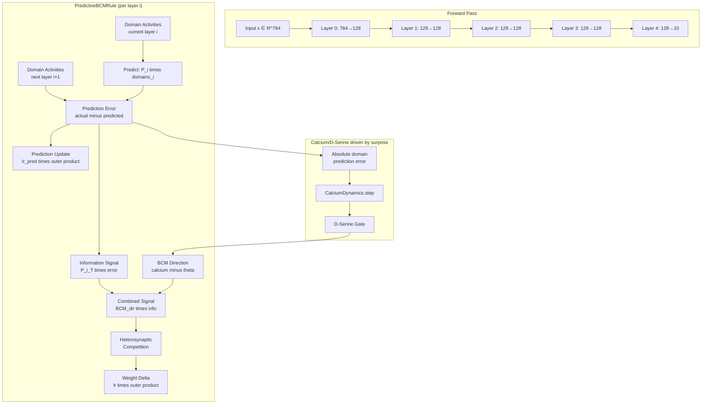
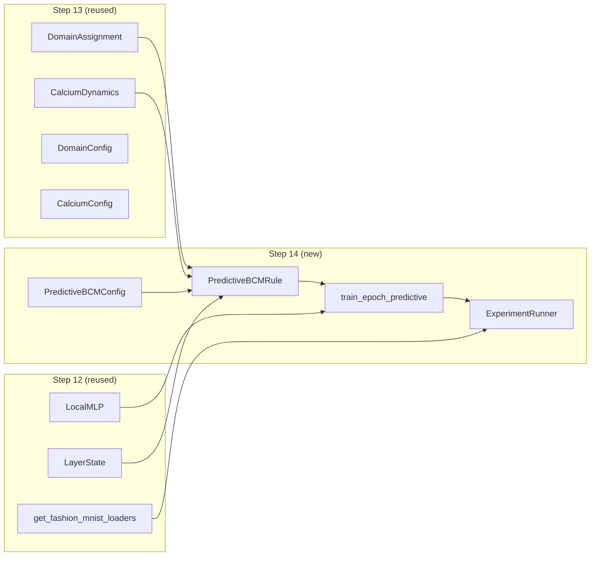

# Design Document: Predictive Coding + BCM (Step 14)

## Overview

This design specifies the implementation of a local learning rule that combines BCM-directed signed updates with inter-layer domain-level prediction errors. The core hypothesis is that prediction errors between adjacent layers provide the missing "task-relevant information channel" that Step 12b identified as necessary for local learning to succeed.

**Key insight**: Each layer maintains a small (8×8) linear prediction of the next layer's domain-level activation. The prediction error (actual - predicted) is signed, local, and informative — it tells the current layer what its domains collectively "get wrong." This error modulates the BCM direction signal, making it task-relevant.

**Why domain-level**: Predictions operate between domain activities (8-dimensional per layer with domain_size=16), not individual neurons (128-dimensional). This is faster, less noisy, and more biologically faithful — astrocytes operate at the domain level (~50μm territory), not per-synapse.

**Combination rule**: BCM direction × domain information signal = combined update direction. Both signals must agree for a strong update. This multiplicative combination ensures that:
- A neuron above its BCM threshold (LTP candidate) in a surprised domain (high prediction error) gets a strong positive update
- A neuron below threshold (LTD candidate) in a surprised domain gets a strong negative update
- Neurons in well-predicted domains (low error) get weak updates regardless of BCM direction

The architecture reuses the 5-layer LocalMLP (784→128→128→128→128→10) and all components from Steps 12, 12b, and 13.

## Architecture

### System Architecture



### Data Flow Per Batch

1. **Forward pass**: `model.forward_with_states(x)` → collects `LayerState` for all 5 layers
2. **For each layer i (0..3)**:
   - Compute domain activities for layer i and layer i+1 from their `post_activation`
   - Compute prediction error at domain level
   - Derive information signal via transpose projection
   - Compute BCM direction (calcium - theta) with D-serine driven by surprise
   - Multiply BCM direction × information signal
   - Apply heterosynaptic competition
   - Compute weight delta via outer product with mean pre-activation
   - Update prediction weights P_i
3. **Layer 4 (output)**: Uses output domain activities as prediction target for layer 3

### Surprise-Driven Calcium Dynamics: Why and How

In Step 13, the calcium dynamics were driven by **raw domain activity** (mean absolute activation of neurons in each domain). This caused a problem: under ReLU, all domains are always active, so calcium always rises, all gates saturate to permanently open, and the gating mechanism provides no selectivity.

In Step 14, we replace the calcium input with **domain surprise** — the absolute magnitude of the domain prediction error: `|actual_next_domain - predicted_next_domain|`.

**What "surprise" means**: A domain is "surprised" when the actual activity of the next layer's corresponding domains deviates significantly from what this layer predicted. High surprise = the network's internal model of this region is wrong. Low surprise = things are going as expected.

**The mechanism**:
- **Surprised domain** (high |prediction error|) → high calcium input → calcium rises above D-serine threshold → gate opens → D-serine released → synapse calcium amplified → LTP enabled → active learning in this domain
- **Unsurprised domain** (low |prediction error|) → low calcium input → calcium stays below threshold → gate closed → no D-serine → synapse calcium not amplified → biased toward LTD → consolidation

**Why this solves the Step 13 saturation problem**: Prediction errors are NOT always high. As predictions improve over training, errors decrease, calcium input drops, gates close, and domains transition from learning to consolidation. Only domains that are still "getting it wrong" remain in active learning mode. This creates a natural curriculum: early in training everything is surprising (all domains learn); later, only the hard parts remain surprising (selective learning).

**Biological grounding**: Astrocytes in cortex respond preferentially to unexpected or novel neural activity patterns — not just to activity level. Mismatch between expected and actual input drives astrocyte calcium transients more strongly than predictable activity. This is consistent with the predictive processing framework in neuroscience (Keller & Mrsic-Flogel, 2018).

### Interface Design

The `PredictiveBCMRule` needs access to ALL layer states simultaneously (to compute prediction errors between adjacent layers). The interface extends the `LocalLearningRule` protocol:

```python
def compute_all_updates(self, states: list[LayerState]) -> list[torch.Tensor]:
    """Compute weight updates for all layers simultaneously.
    
    This is the primary interface. Prediction errors require adjacent
    layer information, so all states must be available.
    """
```

A compatibility shim `compute_update(state: LayerState)` is provided that raises an error directing users to `compute_all_updates`.

## Components and Interfaces

### Component 1: PredictiveBCMConfig (dataclass)

```python
@dataclass(frozen=True)
class PredictiveBCMConfig:
    """Configuration for PredictiveBCMRule."""
    # Main learning rate for weight updates
    lr: float = 0.01
    # Prediction weight learning rate (separate, typically higher)
    lr_pred: float = 0.1
    # BCM sliding threshold EMA decay
    theta_decay: float = 0.99
    # Initial theta value
    theta_init: float = 0.1
    # D-serine calcium amplification factor
    d_serine_boost: float = 1.0
    # Heterosynaptic competition strength (1.0 = full zero-centering)
    competition_strength: float = 1.0
    # Max Frobenius norm of weight delta
    clip_delta: float = 1.0
    # Max Frobenius norm of prediction weight delta
    clip_pred_delta: float = 0.5
    # Combination mode: "multiplicative", "additive", "threshold"
    combination_mode: str = "multiplicative"
    # Ablation flags
    use_d_serine: bool = True
    use_competition: bool = True
    use_domain_modulation: bool = True
    learn_predictions: bool = True
    # Surprise modulation bounds
    max_surprise_amplification: float = 3.0
    # Granularity: "domain" (8-dim) or "neuron" (128-dim)
    granularity: str = "domain"
    # Whether to use fixed random prediction weights (feedback alignment style)
    fixed_predictions: bool = False
```

### Component 2: PredictiveBCMRule (core learning rule)

```python
class PredictiveBCMRule:
    """Predictive coding + BCM directed local learning rule.
    
    Combines:
    - BCM direction (synapse_calcium - theta) from Step 12b
    - Domain-level prediction errors between adjacent layers
    - D-serine gating driven by prediction error (surprise)
    - Heterosynaptic competition within domains
    
    Implements LocalLearningRule protocol.
    """
    name = "predictive_bcm"
    
    def __init__(
        self,
        domain_assignment: DomainAssignment,
        calcium_dynamics: dict[int, CalciumDynamics],
        layer_sizes: list[tuple[int, int]],
        config: PredictiveBCMConfig | None = None,
        device: str = "cpu",
    ): ...
    
    def compute_all_updates(self, states: list[LayerState]) -> list[torch.Tensor]:
        """Compute weight updates for all layers simultaneously."""
        ...
    
    def compute_update(self, state: LayerState) -> torch.Tensor:
        """Single-layer interface (raises error — use compute_all_updates)."""
        raise NotImplementedError(
            "PredictiveBCMRule requires all layer states. "
            "Use compute_all_updates(states) instead."
        )
    
    def get_prediction_errors(self) -> dict[int, torch.Tensor]:
        """Return last-computed prediction errors per layer (for monitoring)."""
        ...
    
    def reset(self) -> None:
        """Reset theta, prediction weights, calcium dynamics."""
        ...
```

### Component 3: Training Loop

```python
def train_epoch_predictive(
    model: LocalMLP,
    rule: PredictiveBCMRule,
    train_loader: DataLoader,
    device: str = "cpu",
) -> dict:
    """Train one epoch using PredictiveBCMRule.
    
    Returns:
        Dict with 'train_loss' and 'prediction_errors' (per-layer means).
    """
```

### Component 4: Experiment Runner

```python
def get_all_conditions() -> list[ExperimentCondition]:
    """Return all 6 experimental conditions."""
    # 1. predictive_bcm_full
    # 2. predictive_bcm_no_astrocyte
    # 3. predictive_only
    # 4. bcm_only (Step 12b baseline)
    # 5. predictive_neuron_level
    # 6. backprop

def run_experiment(
    conditions: list[ExperimentCondition],
    seeds: list[int] = [42, 123, 456],
    n_epochs: int = 50,
    batch_size: int = 128,
    device: str = "cpu",
) -> dict:
    """Run full experiment across conditions and seeds."""
```

### Component 5: Setup Helper

```python
def setup_predictive_bcm_rule(
    config: PredictiveBCMConfig,
    domain_config: DomainConfig,
    calcium_config: CalciumConfig,
    layer_sizes: list[tuple[int, int]],
    device: str = "cpu",
) -> PredictiveBCMRule:
    """Create a fully configured PredictiveBCMRule."""
```

### Dependency Diagram



## Data Models

### Key Tensors and Shapes

For a layer with 128 neurons and domain_size=16 (giving 8 domains):

| Tensor | Shape | Description |
|--------|-------|-------------|
| `post_activation` | (batch, 128) | Layer output after ReLU |
| `domain_activities_current` | (8,) | Mean \|post\| per domain, current layer |
| `domain_activities_next` | (8,) | Mean \|post\| per domain, next layer |
| `P_i` (prediction weights) | (8, 8) | Domain-to-domain prediction matrix |
| `predicted_next` | (8,) | P_i @ domain_activities_current |
| `domain_prediction_error` | (8,) | actual_next - predicted_next (SIGNED) |
| `domain_information` | (8,) | P_i^T @ domain_prediction_error (SIGNED) |
| `info_per_neuron` | (128,) | domain_information broadcast to neurons |
| `synapse_calcium` | (128,) | Mean \|post\| per neuron (batch-averaged) |
| `theta` | (8,) | Sliding BCM threshold per domain |
| `neuron_theta` | (128,) | theta broadcast to neurons |
| `bcm_direction` | (128,) | synapse_calcium - neuron_theta (SIGNED) |
| `combined` | (128,) | bcm_direction × info_per_neuron (SIGNED) |
| `mean_pre` | (in_features,) | Batch-mean of pre-activation |
| `delta_W` | (128, in_features) | lr × outer(combined, mean_pre) |
| `delta_P` | (8, 8) | lr_pred × outer(error, domains_current) |

### Neuron-Level Variant (for comparison)

When `granularity="neuron"`:

| Tensor | Shape | Description |
|--------|-------|-------------|
| `P_i` | (128, 128) | Neuron-to-neuron prediction matrix |
| `predicted_next` | (128,) | P_i @ mean_post_current |
| `prediction_error` | (128,) | mean_post_next - predicted_next |
| `information_signal` | (128,) | P_i^T @ prediction_error |

### PredictiveBCMRule Internal State

```python
class PredictiveBCMRule:
    # Per-layer prediction weights
    _prediction_weights: dict[int, torch.Tensor]  # {layer_idx: (n_domains_next, n_domains_current)}
    
    # Per-layer sliding BCM threshold
    _theta: dict[int, torch.Tensor]  # {layer_idx: (n_domains,)}
    
    # Last prediction errors (for monitoring)
    _last_prediction_errors: dict[int, torch.Tensor]  # {layer_idx: (n_domains_next,)}
    
    # Domain assignment (from Step 13)
    domain_assignment: DomainAssignment
    
    # Per-layer calcium dynamics (from Step 13)
    calcium_dynamics: dict[int, CalciumDynamics]
    
    # Configuration
    config: PredictiveBCMConfig
```

### Experiment Results Schema

```python
{
    "experiment": "predictive_coding_bcm",
    "timestamp": "2026-05-XX ...",
    "conditions": [
        {
            "name": "predictive_bcm_full",
            "seeds": [42, 123, 456],
            "results": [
                {
                    "seed": 42,
                    "n_epochs": 50,
                    "final_accuracy": 0.XX,
                    "final_loss": X.XX,
                    "epoch_results": [
                        {
                            "epoch": 0,
                            "train_loss": X.XX,
                            "test_accuracy": 0.XX,
                            "prediction_errors": {
                                "layer_0": X.XX,
                                "layer_1": X.XX,
                                "layer_2": X.XX,
                                "layer_3": X.XX,
                            }
                        },
                        ...
                    ]
                },
                ...
            ]
        },
        ...
    ],
    "success_criteria": {
        "above_chance": bool,
        "combination_outperforms_parts": bool,
        "prediction_errors_decrease": bool,
        "domain_vs_neuron_comparable": bool,
    }
}
```

## Correctness Properties

*A property is a characteristic or behavior that should hold true across all valid executions of a system — essentially, a formal statement about what the system should do. Properties serve as the bridge between human-readable specifications and machine-verifiable correctness guarantees.*

### Property 1: Prediction Error Sign Correctness

*For any* pair of actual and predicted domain activity vectors, the domain prediction error SHALL have sign(error[d]) == sign(actual[d] - predicted[d]) for every domain d, and SHALL contain both positive and negative values when actual ≠ predicted.

**Validates: Requirements 2.3, 2.4, 16.1**

### Property 2: Information Signal Mathematical Identity

*For any* prediction weight matrix P, current domain activities x, and actual next-layer domain activities y, the information signal SHALL equal P^T @ (y - P @ x) exactly (within floating-point tolerance).

**Validates: Requirements 3.1, 16.2**

### Property 3: Zero Prediction Error Produces Zero Information Signal

*For any* prediction weight matrix P and domain activities x, when actual_next = P @ x (perfect prediction), the information signal SHALL be zero and the prediction error SHALL be zero.

**Validates: Requirements 3.5, 16.3**

### Property 4: Combined Updates Are Signed

*For any* non-degenerate inputs (varied synapse calcium across neurons, non-zero prediction error), the combined update signal SHALL contain both positive and negative values, preserving the signed update property from BCM.

**Validates: Requirements 4.2, 16.4**

### Property 5: Prediction Weight Convergence

*For any* fixed domain activity pair (x, y) presented repeatedly, applying the prediction weight update rule delta_P = lr_pred × outer(y - P@x, x) SHALL reduce |y - P@x| monotonically (within numerical tolerance), and P@x SHALL converge to y.

**Validates: Requirements 5.5, 17.1, 17.2**

### Property 6: Domain Broadcast Preserves Structure

*For any* domain assignment and domain-level information signal, broadcasting to neurons SHALL assign all neurons in domain d the identical value information_signal[d], with no cross-domain contamination.

*Note: "No cross-domain contamination" is a simplification for implementation correctness testing. In biology, chemical signals diffuse across domain boundaries (concentration falls off with distance, not to zero at a boundary), gap junctions propagate calcium between adjacent astrocytes, and structural remodeling can reassign synapses between domains over time. These phenomena are deferred to future steps (volume transmission, glia intercommunication, topology-as-memory). For Step 14, hard domain boundaries let us test whether domain-level prediction works before adding fuzzy boundary complexity.*

**Validates: Requirements 3.2, 3.6**

### Property 7: Normalization Produces Unit Norm

*For any* non-zero domain information signal vector, after L2 normalization (dividing by ||v|| + eps), the resulting vector SHALL have L2 norm approximately equal to 1.0 (within epsilon tolerance). For zero input, the output SHALL be zero.

**Validates: Requirements 3.3**

### Property 8: Multiplicative Combination Correctness

*For any* BCM direction vector and information signal vector, the combined signal SHALL equal their element-wise (Hadamard) product exactly. Positive × positive = positive, positive × negative = negative, negative × negative = positive.

**Validates: Requirements 4.2, 4.3, 4.4**

### Property 9: Output Shape Matches Weights

*For any* valid layer configuration (out_features, in_features) and domain configuration, compute_all_updates SHALL return weight deltas of shape (out_features, in_features) for each layer, and prediction weights SHALL have shape (n_domains_next, n_domains_current).

**Validates: Requirements 1.1, 2.6, 9.2**

### Property 10: Delta Norm Bounded

*For any* valid inputs, the weight delta Frobenius norm SHALL be ≤ clip_delta, and the prediction weight delta Frobenius norm SHALL be ≤ clip_pred_delta.

**Validates: Requirements 5.4, 9.3**

### Property 11: Fixed Predictions Immutability

*For any* sequence of inputs processed with fixed_predictions=True (or learn_predictions=False), the prediction weight matrices SHALL remain identical to their initial values — no updates applied.

**Validates: Requirements 1.5, 5.3, 18.4**

### Property 12: Surprise Modulation Bounded and Directional

*For any* set of domain surprise values, the effective learning rate amplification SHALL not exceed max_surprise_amplification for any domain, AND domains with above-mean surprise SHALL have amplification > 1.0, AND domains with below-mean surprise SHALL have amplification < 1.0. With use_domain_modulation=False, all domains SHALL have amplification = 1.0.

**Validates: Requirements 6.2, 6.3, 6.4, 6.5**

### Property 13: Heterosynaptic Competition Zero-Centers Within Domains

*For any* combined signal with competition_strength=1.0, after competition the mean value within each domain SHALL be approximately zero. With use_competition=False, the signal SHALL be unchanged.

**Validates: Requirements 8.1, 8.3**

### Property 14: Domain Activity Aggregation Correctness

*For any* post_activation tensor of shape (batch, out_features) and domain assignment, domain_activities[d] SHALL equal the mean of absolute values of post_activation averaged over batch and over neurons in domain d.

**Validates: Requirements 2.1**

### Property 15: Ablation Independence — BCM-Only Mode

*For any* valid inputs, when the PredictiveBCMRule is configured to disable prediction error (predictive component removed), the weight updates SHALL depend only on BCM direction, D-serine gating, and competition — matching the behavior of BCMDirectedRule from Step 12b.

**Validates: Requirements 18.1, 18.3**

## Error Handling

### NaN Propagation Prevention

- **Detection**: After each intermediate computation (domain activities, prediction error, information signal, combined signal), check for NaN values
- **Recovery**: Replace NaN with zero using `torch.nan_to_num(tensor, nan=0.0)`
- **Logging**: Count NaN occurrences per epoch for diagnostics (but don't halt training)
- **Root causes**: Division by zero in normalization (mitigated by epsilon), degenerate weight matrices, extreme activation values

### Numerical Stability

- **Normalization epsilon**: Use eps=1e-8 in all divisions to prevent divide-by-zero
- **Gradient clipping**: Both weight deltas and prediction weight deltas are norm-clipped
- **Calcium bounds**: CalciumDynamics already clamps ca ∈ [0, ca_max] and h ∈ [0, 1]
- **Theta non-negativity**: Sliding threshold clamped to ≥ 0

### Edge Cases

- **Single-neuron domains**: If domain_size > layer_size, some domains may have 1 neuron. Competition is skipped for single-neuron domains (no mean to subtract).
- **All-zero activations**: If a layer produces all zeros (dead ReLU), domain activities = 0, prediction error = -predicted (non-zero if P ≠ 0), learning still occurs on prediction weights.
- **Last layer handling**: The output layer (10 neurons) has fewer domains. Prediction from layer 3 to layer 4 uses the output layer's domain structure (which may have domains of different sizes).

### Device Consistency

- All tensors created within PredictiveBCMRule are placed on the same device as the model weights
- Prediction weights, theta, and intermediate computations all respect the configured device
- No implicit CPU↔GPU transfers

## Testing Strategy

### Property-Based Tests (Hypothesis, minimum 100 iterations each)

The following properties will be tested using the `hypothesis` library with `@given` decorators generating random valid inputs:

| Property | Test Description | Min Iterations |
|----------|-----------------|:--------------:|
| 1 | Prediction error sign correctness | 200 |
| 2 | Information signal = P^T @ (actual - P@x) | 200 |
| 3 | Zero error → zero information | 200 |
| 4 | Combined updates are signed | 200 |
| 5 | Prediction weight convergence | 100 |
| 6 | Domain broadcast preserves structure | 200 |
| 7 | Normalization produces unit norm | 200 |
| 8 | Multiplicative combination correctness | 200 |
| 9 | Output shape matches weights | 200 |
| 10 | Delta norm bounded | 200 |
| 11 | Fixed predictions immutability | 200 |
| 12 | Surprise modulation bounded | 200 |
| 13 | Competition zero-centers | 200 |
| 14 | Domain activity aggregation | 200 |
| 15 | Ablation independence (BCM-only mode) | 100 |

**PBT Library**: `hypothesis` (already used in Steps 12b and 13)

**Tag format**: Each test will be tagged with:
```python
# Feature: predictive-coding-bcm, Property {N}: {property_text}
```

### Unit Tests (Example-Based)

- Configuration defaults and frozen dataclass behavior
- Device placement (CPU tensor check)
- Last-layer prediction target selection (output domains vs one-hot labels)
- Combination mode switching (multiplicative/additive/threshold)
- Protocol compliance (name attribute, method signatures)
- Training loop return format

### Integration Tests

- Full training loop runs without error for 1 epoch
- Experiment runner produces valid JSON output
- Prediction errors decrease over 5 epochs on FashionMNIST
- All 6 conditions produce results with expected schema
- Computational overhead measurement (domain-level < 20% overhead vs BCM alone)
- Domain-level vs neuron-level timing comparison (domain should be 10×+ faster)

### Smoke Tests

- `PredictiveBCMRule` instantiates with default config
- `get_all_conditions()` returns 6 conditions
- `rule.name == "predictive_bcm"`
- Config fields have correct types and defaults

