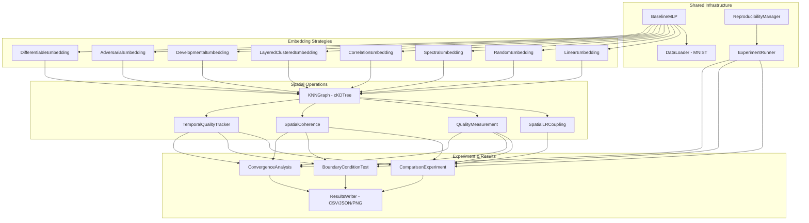

# Design Document: Spatial Embedding Experiments (Step 01)

## Overview

This design implements Step 01 of the glia-augmented neural network research plan: assigning spatial coordinates to every weight in a neural network and validating whether that spatial structure carries useful information for optimization.

The system operates at **Simulation Fidelity Level 1** (Null-Space) — spatial geometry affects only the learning process, not inference. The core output is a positions array of shape `(N_weights, 3)` that all subsequent research steps consume.

Informed by Critical Review 3, this design includes: an adversarial embedding baseline for the three-point validation curve, differentiable positions as a learnable embedding, temporal quality tracking during training, a spatial coherence metric (PCA-based), and a spatially-structured benchmark task alongside MNIST.

### Key Design Decisions

1. **Embedding as a pure function**: Each embedding strategy is a callable that takes a model (and optionally data) and returns an `ndarray` of shape `(N, 3)`. This clean contract enables downstream steps to swap embeddings without code changes.

2. **Subsampling for O(N²) operations**: With ~200K weights, pairwise operations (gradient correlation, quality measurement) are intractable at full scale. We use random pair subsampling with configurable sample sizes.

3. **SciPy for spatial operations**: `cKDTree` for KNN graph construction, `scipy.sparse` for Laplacian representation, `scipy.sparse.linalg.eigsh` for spectral decomposition. These are mature, well-optimized implementations.

4. **Separation of concerns**: The experiment runner orchestrates training loops and metric collection. Embedding strategies, quality measurement, and spatial coupling are independent modules that compose cleanly.

5. **Developmental embedding bootstrapping**: The chicken-and-egg problem (need gradients to compute correlations, need good embedding to benefit from spatial coupling) is resolved by training the base model first without coupling, then computing the developmental embedding from the trained model's gradient statistics.

6. **Weight-level embedding for Step 01, neuron-level for Level 2+**: At Level 1, we embed individual weights in 3D space because we're testing whether *any* spatial structure helps learning — weight-level is the most general and allows different weights on the same neuron to land in different astrocyte domains (biologically accurate: synapses on the same neuron can be in different glial territories). However, for Level 2+ (signal traversal), the natural primitive becomes the **neuron** — neurons have positions, connections between neurons define axon paths through space, and weights/synapses inherit positions from their source/target neuron pair. The refactoring path is: neuron positions → weight positions derived as f(source_pos, target_pos) → axon paths as line segments between neuron positions. This is recorded as a forward-looking design decision; Step 01 proceeds with weight-level embedding since signal traversal is not yet in scope.

## Architecture



### Directory Layout

```
steps/01-spatial-embedding/
├── README.md
├── docs/
│   └── decisions.md
├── code/
│   ├── __init__.py
│   ├── model.py              # BaselineMLP
│   ├── data.py               # MNIST data loading
│   ├── topographic_task.py   # Spatially-structured benchmark task
│   ├── embeddings/
│   │   ├── __init__.py
│   │   ├── base.py           # EmbeddingStrategy protocol
│   │   ├── linear.py
│   │   ├── random.py
│   │   ├── spectral.py
│   │   ├── correlation.py
│   │   ├── layered_clustered.py
│   │   ├── developmental.py
│   │   ├── adversarial.py    # Anti-correlated embedding (negative control)
│   │   └── differentiable.py # Learnable positions via spatial coherence loss
│   ├── spatial/
│   │   ├── __init__.py
│   │   ├── knn_graph.py      # KNN graph construction
│   │   ├── lr_coupling.py    # Spatial LR coupling
│   │   ├── quality.py        # Embedding quality measurement
│   │   ├── coherence.py      # Spatial coherence metric (PCA-based)
│   │   └── temporal_tracking.py  # Quality over training time
│   ├── experiment/
│   │   ├── __init__.py
│   │   ├── runner.py         # ExperimentRunner
│   │   ├── comparison.py     # Full comparison experiment
│   │   ├── boundary.py       # Boundary condition test
│   │   ├── convergence.py    # Developmental convergence analysis
│   │   └── reproducibility.py # Seed management, metadata logging
│   └── visualization/
│       ├── __init__.py
│       └── plots.py          # All plotting functions
├── data/
│   └── (model checkpoints, cached embeddings)
└── results/
    └── (CSV files, plots, metadata JSON, summary markdown)
```

## Components and Interfaces

### Core Protocol: EmbeddingStrategy

```python
from typing import Protocol
import numpy as np
import torch.nn as nn

class EmbeddingStrategy(Protocol):
    """Contract for all spatial embedding strategies.
    
    Every embedding takes a model and returns positions for all weights.
    Some embeddings also require data (correlation, developmental).
    """
    
    @property
    def name(self) -> str:
        """Human-readable name for results reporting."""
        ...
    
    def embed(self, model: nn.Module, **kwargs) -> np.ndarray:
        """Compute spatial positions for all weights in the model.
        
        Args:
            model: The neural network whose weights to embed.
            **kwargs: Strategy-specific arguments (e.g., data_loader, n_steps).
            
        Returns:
            ndarray of shape (N_weights, 3) with coordinates in [0, 1].
        """
        ...
```

### BaselineMLP

```python
class BaselineMLP(nn.Module):
    """2-hidden-layer MLP for MNIST classification.
    
    Architecture: 784 → 256 (ReLU) → 256 (ReLU) → 10
    Total weights: 784*256 + 256*256 + 256*10 = 203,264 (+ biases)
    """
    
    def __init__(self):
        ...
    
    def forward(self, x: torch.Tensor) -> torch.Tensor:
        ...
    
    def get_weight_count(self) -> int:
        """Total number of weight parameters (excluding biases)."""
        ...
    
    def get_weight_metadata(self) -> list[WeightInfo]:
        """Return metadata for each weight: layer, source neuron, target neuron."""
        ...
    
    def get_flat_weights(self) -> torch.Tensor:
        """Return all weights as a flat 1D tensor."""
        ...
    
    def get_flat_gradients(self) -> torch.Tensor:
        """Return all weight gradients as a flat 1D tensor after backward()."""
        ...
```

### KNNGraph

```python
class KNNGraph:
    """K-nearest-neighbor graph over spatial positions using cKDTree.
    
    Provides efficient neighbor lookups for spatial coupling and
    quality measurement operations.
    """
    
    def __init__(self, positions: np.ndarray, k: int = 10):
        """Build KNN graph using scipy.spatial.cKDTree.
        
        Args:
            positions: (N, 3) array of spatial coordinates.
            k: Number of nearest neighbors per node.
        """
        ...
    
    @property
    def neighbor_indices(self) -> np.ndarray:
        """(N, k) array of neighbor indices for each node."""
        ...
    
    @property
    def neighbor_distances(self) -> np.ndarray:
        """(N, k) array of distances to each neighbor."""
        ...
    
    def get_neighbors(self, idx: int) -> tuple[np.ndarray, np.ndarray]:
        """Return (indices, distances) for neighbors of node idx."""
        ...
```

### SpatialLRCoupling

```python
class SpatialLRCoupling:
    """Modulates per-weight learning rates by averaging with spatial neighbors.
    
    Integrates with PyTorch's Adam optimizer by scaling the per-parameter
    learning rate using the KNN graph. Does not break autograd — operates
    on optimizer state, not the computation graph.
    """
    
    def __init__(self, knn_graph: KNNGraph, alpha: float = 0.5):
        """
        Args:
            knn_graph: Pre-built KNN graph over weight positions.
            alpha: Coupling strength in [0, 1].
                   0 = no coupling (standard Adam).
                   1 = full neighbor averaging.
        """
        ...
    
    def compute_effective_lr(
        self, base_lr: np.ndarray
    ) -> np.ndarray:
        """Compute spatially-coupled learning rates.
        
        effective_lr[i] = (1 - alpha) * base_lr[i] + alpha * mean(base_lr[neighbors[i]])
        
        Args:
            base_lr: (N,) array of per-weight base learning rates.
            
        Returns:
            (N,) array of effective learning rates.
        """
        ...
    
    def apply_to_optimizer(self, optimizer: torch.optim.Adam) -> None:
        """Apply spatial coupling to optimizer's per-parameter learning rates.
        
        Modifies optimizer param_groups in-place. Called once per training step.
        """
        ...
```

### QualityMeasurement

```python
class QualityMeasurement:
    """Measures embedding quality as correlation between spatial distance
    and gradient correlation across weight pairs.
    
    Uses random subsampling when N_pairs > max_pairs to keep computation
    tractable for the ~200K weight network.
    """
    
    def __init__(
        self,
        positions: np.ndarray,
        max_pairs: int = 10_000_000,
        n_bootstrap: int = 1000,
    ):
        ...
    
    def compute_gradient_correlations(
        self,
        model: nn.Module,
        data_loader: DataLoader,
        n_batches: int = 50,
    ) -> np.ndarray:
        """Compute pairwise gradient correlations over multiple batches.
        
        Returns:
            (n_sampled_pairs,) array of Pearson correlations between
            gradient vectors of sampled weight pairs.
        """
        ...
    
    def compute_quality_score(
        self,
        model: nn.Module,
        data_loader: DataLoader,
        n_batches: int = 50,
    ) -> QualityResult:
        """Compute the embedding quality score with confidence interval.
        
        Returns:
            QualityResult with score, ci_lower, ci_upper, n_pairs_sampled.
        """
        ...
```

### ExperimentRunner

```python
class ExperimentRunner:
    """Orchestrates experiment execution with reproducibility guarantees.
    
    Handles seed management, metadata logging, checkpoint saving,
    and results collection for all experimental conditions.
    """
    
    def __init__(self, results_dir: Path, seed: int = 42):
        ...
    
    def set_seeds(self, seed: int) -> None:
        """Set Python, NumPy, and PyTorch random seeds."""
        ...
    
    def log_metadata(self, experiment_name: str, config: dict) -> None:
        """Write hyperparameters, versions, hardware info to JSON."""
        ...
    
    def run_condition(
        self,
        condition_name: str,
        model_factory: Callable,
        embedding: EmbeddingStrategy | None,
        coupling_config: CouplingConfig | None,
        n_epochs: int,
        seed: int,
    ) -> ConditionResult:
        """Run a single experimental condition (one seed).
        
        Returns metrics: final_accuracy, steps_to_95pct, quality_score,
        wall_clock_time.
        """
        ...
    
    def run_comparison(
        self,
        conditions: list[ConditionSpec],
        n_seeds: int = 3,
    ) -> ComparisonResult:
        """Run all conditions across multiple seeds.
        
        Returns aggregated results with mean/std for each metric.
        """
        ...
```

### Embedding Strategy Implementations

#### LinearEmbedding

```python
class LinearEmbedding:
    """Maps weight indices directly to normalized 3D coordinates.
    
    x = layer_index / total_layers
    y = source_neuron / max_neurons_in_layer
    z = target_neuron / max_neurons_in_layer
    """
    name = "linear"
    
    def embed(self, model: nn.Module, **kwargs) -> np.ndarray:
        ...
```

#### RandomEmbedding

```python
class RandomEmbedding:
    """Assigns uniformly random 3D coordinates with a fixed seed."""
    name = "random"
    
    def __init__(self, seed: int = 42):
        self.seed = seed
    
    def embed(self, model: nn.Module, **kwargs) -> np.ndarray:
        ...
```

#### SpectralEmbedding

```python
class SpectralEmbedding:
    """Topology-preserving embedding from graph Laplacian eigenvectors.
    
    Connectivity is defined at the neuron level: two weights are "connected"
    if they share a source or target neuron. The graph Laplacian is built
    over this neuron-level adjacency, then coordinates are assigned to
    weights based on their source/target neuron positions.
    
    For a fully-connected MLP, direct weight-level adjacency is trivial
    (all weights in adjacent layers connect). Instead, we build the graph
    at the neuron level and interpolate to weights.
    """
    name = "spectral"
    
    def embed(self, model: nn.Module, **kwargs) -> np.ndarray:
        ...
    
    def _build_neuron_adjacency(self, model: nn.Module) -> sparse.csr_matrix:
        """Build adjacency matrix at neuron level from weight magnitudes."""
        ...
    
    def _compute_laplacian_eigenvectors(
        self, adjacency: sparse.csr_matrix, n_components: int = 3
    ) -> np.ndarray:
        """Compute smallest non-trivial eigenvectors using scipy.sparse.linalg.eigsh."""
        ...
```

#### CorrelationEmbedding

```python
class CorrelationEmbedding:
    """Embeds weights so that those with correlated activations are close.
    
    Computes pairwise activation correlations by running data through the
    network, then uses MDS to embed the correlation distance matrix into 3D.
    
    Due to O(N²) cost of full pairwise correlation on ~200K weights,
    operates on a subsampled set and interpolates remaining positions.
    """
    name = "correlation"
    
    def __init__(self, n_batches: int = 10, subsample_size: int = 5000):
        ...
    
    def embed(self, model: nn.Module, **kwargs) -> np.ndarray:
        """Requires data_loader in kwargs."""
        ...
```

#### LayeredClusteredEmbedding

```python
class LayeredClusteredEmbedding:
    """Hybrid: layer depth on x-axis, spectral clustering within layers on y/z.
    
    Preserves the natural layer structure while allowing within-layer
    organization based on connectivity patterns.
    """
    name = "layered_clustered"
    
    def embed(self, model: nn.Module, **kwargs) -> np.ndarray:
        ...
```

#### DevelopmentalEmbedding

```python
class DevelopmentalEmbedding:
    """Co-evolving embedding that self-organizes based on gradient correlations.
    
    Resolution of the chicken-and-egg problem:
    1. Train the model for a warmup period (e.g., 5 epochs) without spatial coupling
    2. Compute gradient correlations from the partially-trained model
    3. Iteratively update positions: attract correlated weights, repel uncorrelated
    4. Track quality score at each step to monitor convergence
    
    The warmup ensures meaningful gradient statistics exist before
    position optimization begins.
    """
    name = "developmental"
    
    def __init__(
        self,
        n_steps: int = 1000,
        position_lr: float = 0.01,
        n_correlation_batches: int = 10,
        record_interval: int = 50,
        subsample_pairs: int = 50000,
    ):
        ...
    
    def embed(self, model: nn.Module, **kwargs) -> np.ndarray:
        """Requires data_loader in kwargs. Model should be partially trained."""
        ...
    
    def get_convergence_history(self) -> list[float]:
        """Return quality scores recorded at each interval."""
        ...
```

#### AdversarialEmbedding

```python
class AdversarialEmbedding:
    """Deliberately anti-correlated embedding for negative control.
    
    Computes gradient correlations from a partially-trained model, then
    assigns positions that MAXIMIZE spatial distance between highly-correlated
    weight pairs. This is the negative end of the three-point validation curve:
    adversarial (should hurt) → random (neutral) → good (should help).
    
    If spatial coupling with this embedding hurts performance, it confirms
    that spatial structure matters directionally, not just as regularization.
    """
    name = "adversarial"
    
    def __init__(self, n_correlation_batches: int = 10, subsample_pairs: int = 50000):
        ...
    
    def embed(self, model: nn.Module, **kwargs) -> np.ndarray:
        """Requires data_loader in kwargs. Model should be partially trained.
        
        Algorithm:
        1. Compute gradient correlations between weight pairs
        2. Use MDS on NEGATED correlation matrix (anti-MDS)
           - Highly correlated weights get maximally distant positions
        3. Normalize to [0, 1]
        """
        ...
```

#### DifferentiableEmbedding

```python
class DifferentiableEmbedding:
    """Learnable spatial positions optimized via spatial coherence loss.
    
    Positions are PyTorch Parameters that are jointly optimized with the
    network weights. A spatial coherence loss penalizes configurations where
    gradient-correlated weights are spatially distant.
    
    This solves the chicken-and-egg problem more cleanly than the
    developmental approach: gradients flow through both the task loss
    and the spatial loss simultaneously.
    
    Loss = task_loss + lambda_spatial * spatial_coherence_loss
    
    Where spatial_coherence_loss = mean(spatial_distance(i,j) * gradient_correlation(i,j))
    for sampled pairs (i,j) with positive gradient correlation.
    """
    name = "differentiable"
    
    def __init__(
        self,
        lambda_spatial: float = 0.01,
        subsample_pairs: int = 10000,
        position_lr: float = 1e-3,
    ):
        self.lambda_spatial = lambda_spatial
        self.subsample_pairs = subsample_pairs
        self.position_lr = position_lr
        self.positions_param: torch.nn.Parameter | None = None
    
    def initialize(self, n_weights: int) -> torch.nn.Parameter:
        """Create the learnable positions parameter.
        
        Returns the Parameter so it can be added to the optimizer.
        Initialized with uniform random values in [0, 1].
        """
        ...
    
    def compute_spatial_loss(
        self, gradients: torch.Tensor
    ) -> torch.Tensor:
        """Compute spatial coherence loss from current gradients.
        
        Samples pairs, computes gradient correlations, penalizes
        high-correlation pairs that are spatially distant.
        """
        ...
    
    def embed(self, model: nn.Module, **kwargs) -> np.ndarray:
        """Return current positions as numpy array.
        
        Can be called at any point during training to snapshot positions.
        Applies sigmoid to ensure [0, 1] range.
        """
        ...
```

### Spatial Coherence Measurement

```python
class SpatialCoherence:
    """Measures whether spatially close weights develop similar PCA projections.
    
    This tests the MECHANISM directly: if spatial coupling produces spatially
    organized representations, spatially close weights should have similar
    projections onto the top principal components of the weight matrix.
    
    Distinguishes the strong claim (spatial structure matters) from the weak
    claim (spatial smoothing is just regularization).
    """
    
    def __init__(self, n_components: int = 10, max_pairs: int = 100000):
        ...
    
    def compute_coherence(
        self, weights: np.ndarray, positions: np.ndarray
    ) -> float:
        """Compute spatial coherence score.
        
        1. Compute top-k PCA components of weight matrix
        2. For sampled pairs, compute spatial distance and PC similarity
        3. Return Pearson correlation between distances and similarities
        
        High positive correlation = spatially close weights have similar
        PC projections = spatial coupling is producing organized structure.
        """
        ...
```

### Temporal Quality Tracker

```python
class TemporalQualityTracker:
    """Tracks embedding quality at intervals during training.
    
    Detects whether an initially good embedding degrades as the network's
    functional structure evolves during learning. Critical for understanding
    whether fixed embeddings (spectral, correlation) remain valid throughout
    training or need periodic recomputation.
    """
    
    def __init__(self, record_interval_epochs: int = 2):
        self.record_interval = record_interval_epochs
        self.history: list[tuple[int, int, float]] = []  # (epoch, step, score)
    
    def record(
        self,
        epoch: int,
        step: int,
        quality_measurement: QualityMeasurement,
        model: nn.Module,
        data_loader: DataLoader,
    ) -> float:
        """Record quality score at current training point."""
        ...
    
    def get_trajectory(self) -> list[tuple[int, int, float]]:
        """Return full (epoch, step, score) trajectory."""
        ...
    
    def detect_degradation(self, threshold: float = 0.5) -> bool:
        """Return True if quality dropped by more than threshold fraction."""
        ...
```

### Topographic Task

```python
class TopographicTask:
    """A benchmark task with inherent spatial structure.
    
    Simulates a topographic sensor array where spatially adjacent sensors
    receive correlated signals. The task is to classify patterns in this
    sensor field. Unlike MNIST (permutation-invariant), this task has a
    known ground-truth spatial structure that the embedding should discover.
    
    Design: A 2D grid of sensors (e.g., 16x16 = 256 inputs) where each
    sensor reads a local patch of a larger signal field. Adjacent sensors
    have overlapping receptive fields, creating natural spatial correlations.
    The classification task requires integrating information across the
    sensor field in a spatially structured way.
    """
    
    def __init__(
        self,
        grid_size: int = 16,
        n_classes: int = 10,
        n_train: int = 50000,
        n_test: int = 10000,
        correlation_length: float = 3.0,
    ):
        ...
    
    def generate_dataset(self, seed: int = 42) -> tuple[DataLoader, DataLoader]:
        """Generate train and test data loaders.
        
        Returns (train_loader, test_loader) with spatially-structured inputs.
        """
        ...
    
    def get_ground_truth_embedding(self) -> np.ndarray:
        """Return the known-correct spatial structure for this task.
        
        For the topographic task, the ground truth is that weights connecting
        adjacent sensors should be spatially close. This provides a reference
        embedding to compare learned embeddings against.
        """
        ...
```

## Data Models

### Configuration Types

```python
from dataclasses import dataclass
from pathlib import Path

@dataclass
class ExperimentConfig:
    """Top-level experiment configuration."""
    step_dir: Path                    # steps/01-spatial-embedding/
    n_epochs: int = 20
    batch_size: int = 128
    base_lr: float = 1e-3
    n_seeds: int = 3
    seeds: list[int] = field(default_factory=lambda: [42, 123, 456])

@dataclass
class CouplingConfig:
    """Configuration for spatial LR coupling."""
    k: int = 10                       # KNN neighbors
    alpha: float = 0.5                # Coupling strength [0, 1]

@dataclass
class QualityConfig:
    """Configuration for quality measurement."""
    n_batches: int = 50               # Batches for gradient correlation
    max_pairs: int = 10_000_000       # Max pairs before subsampling
    n_bootstrap: int = 1000           # Bootstrap samples for CI

@dataclass
class DevelopmentalConfig:
    """Configuration for developmental embedding."""
    n_steps: int = 1000
    position_lr: float = 0.01
    warmup_epochs: int = 5
    record_interval: int = 50
    subsample_pairs: int = 50000
```

### Result Types

```python
@dataclass
class QualityResult:
    """Result of embedding quality measurement."""
    score: float                      # Pearson correlation
    ci_lower: float                   # 95% CI lower bound
    ci_upper: float                   # 95% CI upper bound
    n_pairs_sampled: int              # Number of pairs used
    computation_time_seconds: float

@dataclass
class ConditionResult:
    """Result of a single experimental condition (one seed)."""
    condition_name: str
    seed: int
    final_test_accuracy: float
    steps_to_95pct: int               # Training steps to reach 95% of final acc
    quality_score: QualityResult
    wall_clock_seconds: float
    embedding_method: str
    coupling_enabled: bool

@dataclass
class ComparisonResult:
    """Aggregated results across seeds for one condition."""
    condition_name: str
    n_seeds: int
    accuracy_mean: float
    accuracy_std: float
    steps_to_95pct_mean: float
    steps_to_95pct_std: float
    quality_score_mean: float
    quality_score_std: float

@dataclass
class BoundaryResult:
    """Result of the boundary condition test."""
    correlation_coefficient: float    # Pearson r between quality and delta
    p_value: float
    embedding_scores: dict[str, float]
    performance_deltas: dict[str, float]

@dataclass
class ConvergenceResult:
    """Result of developmental embedding convergence analysis."""
    quality_trajectory: list[float]   # Score at each record interval
    converged: bool                   # < 5% relative change in final 20%
    final_quality: float
    best_fixed_quality: float         # Best score from non-developmental methods
    n_steps_to_stability: int | None  # Step where convergence detected

@dataclass
class TemporalQualityResult:
    """Result of quality tracking over training time."""
    trajectory: list[tuple[int, int, float]]  # (epoch, step, score)
    initial_quality: float
    final_quality: float
    degraded: bool                    # Quality dropped > 50%
    min_quality: float                # Lowest quality during training
    min_quality_epoch: int

@dataclass
class SpatialCoherenceResult:
    """Result of spatial coherence measurement."""
    coherence_score: float            # Pearson r between distance and PC similarity
    coupled_coherence: float          # Score for spatially-coupled training
    uncoupled_coherence: float        # Score for uncoupled training
    mechanism_confirmed: bool         # coupled > uncoupled significantly

@dataclass
class ThreePointValidation:
    """Result of the three-point validation curve."""
    adversarial_delta: float          # Performance delta with adversarial embedding
    random_delta: float               # Performance delta with random embedding
    best_delta: float                 # Performance delta with best embedding
    monotonic: bool                   # adversarial < random < best (validates theory)

@dataclass
class ExperimentMetadata:
    """Metadata logged for reproducibility."""
    experiment_name: str
    timestamp: str
    random_seeds: list[int]
    hyperparameters: dict
    library_versions: dict            # torch, numpy, scipy, sklearn versions
    hardware_info: dict               # GPU name, CUDA version, CPU info
    git_hash: str | None
```

### File Outputs

| File | Format | Contents |
|------|--------|----------|
| `results/embedding_quality.csv` | CSV | method, score, ci_lower, ci_upper, computation_time |
| `results/comparison_results.csv` | CSV | condition, seed, accuracy, steps_to_95pct, quality, coherence, time |
| `results/boundary_condition.csv` | CSV | method, quality_score, performance_delta |
| `results/developmental_convergence.csv` | CSV | step, quality_score |
| `results/temporal_quality.csv` | CSV | method, epoch, step, quality_score |
| `results/spatial_coherence.csv` | CSV | method, coupled, uncoupled, coherence_score |
| `results/three_point_validation.csv` | CSV | adversarial_delta, random_delta, best_delta, monotonic |
| `results/topographic_results.csv` | CSV | method, task, accuracy, quality, coherence |
| `results/metadata_{experiment}_{timestamp}.json` | JSON | ExperimentMetadata |
| `results/embedding_vs_performance.png` | PNG | Scatter plot |
| `results/boundary_regression.png` | PNG | Quality vs delta with regression line |
| `results/three_point_curve.png` | PNG | Adversarial → random → good validation |
| `results/developmental_trajectory.png` | PNG | Quality over update steps |
| `results/temporal_quality_trajectories.png` | PNG | Quality over training time per method |
| `results/spatial_coherence_comparison.png` | PNG | Coupled vs uncoupled coherence |
| `results/summary.md` | Markdown | Key findings, observations, implications |

## Correctness Properties

*A property is a characteristic or behavior that should hold true across all valid executions of a system — essentially, a formal statement about what the system should do. Properties serve as the bridge between human-readable specifications and machine-verifiable correctness guarantees.*

### Property 1: Embedding output contract (shape and range)

*For any* embedding strategy and *for any* neural network model, calling `embed(model)` SHALL produce an ndarray of shape `(N_weights, 3)` where `N_weights` equals the total number of weight parameters in the model, and all coordinate values are in the range [0, 1].

**Validates: Requirements 3.2, 4.1, 4.2, 5.3, 6.3, 7.3, 8.4**

### Property 2: Embedding determinism

*For any* embedding strategy and *for any* fixed set of inputs (model state, random seed, data), calling `embed()` twice with identical inputs SHALL produce identical position arrays (element-wise equality).

**Validates: Requirements 4.3, 14.2**

### Property 3: Linear embedding formula

*For any* weight identified by `(layer_index, source_neuron, target_neuron)` in a model with `total_layers` layers and `max_neurons` neurons per layer, the linear embedding SHALL produce coordinates `(layer_index / total_layers, source_neuron / max_neurons, target_neuron / max_neurons)`.

**Validates: Requirements 3.1**

### Property 4: Layered clustered x-coordinate preserves layer structure

*For any* model and *for any* weight in that model, the x-coordinate produced by the layered-clustered embedding SHALL equal the weight's layer index divided by the total number of layers. Furthermore, all weights in the same layer SHALL have identical x-coordinates.

**Validates: Requirements 7.1**

### Property 5: Developmental force direction

*For any* pair of weight positions and *for any* gradient correlation value between them: if the correlation is positive, the computed force SHALL be attractive (moves positions closer together); if the correlation is zero or negative, the computed force SHALL be repulsive (moves positions apart).

**Validates: Requirements 8.2**

### Property 6: Quality score is Pearson correlation of distances vs gradient correlations

*For any* set of spatial positions and *for any* set of per-weight gradient vectors, the embedding quality score SHALL equal the Pearson correlation coefficient between the vector of pairwise Euclidean distances and the vector of pairwise gradient correlations (computed over the same set of weight pairs).

**Validates: Requirements 9.1**

### Property 7: Confidence interval contains point estimate

*For any* quality measurement result, the 95% confidence interval bounds SHALL satisfy `ci_lower <= score <= ci_upper`.

**Validates: Requirements 9.3**

### Property 8: Spatial LR coupling formula

*For any* set of spatial positions, *for any* base learning rate array, *for any* k ≥ 1, and *for any* alpha in [0, 1]: the effective learning rate for weight i SHALL equal `(1 - alpha) * base_lr[i] + alpha * mean(base_lr[knn_neighbors_of_i])`. In particular, when alpha = 0, effective_lr SHALL equal base_lr; when alpha = 1, effective_lr[i] SHALL equal the mean of its k-nearest neighbors' learning rates.

**Validates: Requirements 10.2, 10.3**

### Property 9: Subsampling threshold

*For any* set of N positions where `N * (N-1) / 2 > max_pairs`, the quality measurement SHALL use fewer than `N * (N-1) / 2` pairs. *For any* set of N positions where `N * (N-1) / 2 <= max_pairs`, the quality measurement SHALL use all pairs.

**Validates: Requirements 9.5**

### Property 10: Convergence detection

*For any* quality score trajectory (a sequence of floats), the convergence detector SHALL report `converged = True` if and only if the maximum relative change between consecutive values in the final 20% of the trajectory is less than 5%.

**Validates: Requirements 13.3**

### Property 11: Adversarial embedding produces negative quality score

*For any* model with non-trivial gradient correlations (at least some weight pairs have correlation > 0.1), the adversarial embedding SHALL produce an Embedding_Quality_Score that is positive (meaning spatial distance positively correlates with gradient correlation — correlated weights are far apart). This is the opposite sign from a good embedding.

**Validates: Requirements 15.3**

### Property 12: Differentiable embedding positions remain in [0, 1]

*For any* training step and *for any* gradient update to the position parameters, the differentiable embedding SHALL produce positions where all coordinates are in [0, 1] after the normalization step (sigmoid or clamping).

**Validates: Requirements 16.4**

### Property 13: Spatial coherence is higher for coupled than uncoupled training

*For any* embedding with positive quality score, training with Spatial_LR_Coupling SHALL produce a Spatial_Coherence_Score that is greater than or equal to the score from uncoupled training. (This is a statistical property — validated empirically, not universally.)

**Validates: Requirements 18.5**

### Property 14: Three-point validation monotonicity

*For any* embedding quality score ordering where adversarial < random < good, the performance deltas SHALL follow the same ordering: adversarial_delta < random_delta < best_delta. (This is the core prediction of the spatial structure hypothesis.)

**Validates: Requirements 15.4, 12.1**

### Property 15: Temporal quality degradation detection

*For any* quality trajectory where the minimum value is less than 50% of the initial value, the degradation detector SHALL report `degraded = True`. *For any* trajectory where all values remain above 50% of the initial value, it SHALL report `degraded = False`.

**Validates: Requirements 17.3**

## Error Handling

### Spectral Embedding: Disconnected Components

When the graph Laplacian has disconnected components (zero eigenvalue multiplicity > 1), the spectral embedding handles each connected component independently:
1. Identify connected components via sparse graph traversal
2. Compute spectral embedding within each component
3. Offset components spatially so they don't overlap (stack along x-axis with gaps)
4. Normalize final coordinates to [0, 1]

### Correlation Embedding: Insufficient Data

If fewer batches than `n_batches` are available in the data loader:
- Use all available batches
- Log a warning with the actual batch count used
- Proceed with computation (MDS can still produce valid output from fewer samples)

### Quality Measurement: Degenerate Cases

- If all spatial distances are identical (degenerate embedding): return score = 0.0 with a warning
- If all gradient correlations are identical: return score = 0.0 with a warning
- If subsampled pairs are too few for meaningful bootstrap: increase sample size or report wider CI

### Developmental Embedding: Non-Convergence

If the developmental embedding does not converge within `n_steps`:
- Return the final positions regardless (they may still be useful)
- Set `converged = False` in the result
- Log the final quality score and the trajectory for diagnosis

### KNN Graph: Edge Cases

- If k >= N (more neighbors requested than nodes exist): clamp k to N-1
- If positions contain duplicate points: cKDTree handles this gracefully; duplicates get distance 0

### Numerical Stability

- Pearson correlation computation uses `scipy.stats.pearsonr` which handles edge cases (constant arrays return NaN)
- Eigenvector computation uses `eigsh` with `sigma=0` shift-invert mode for numerical stability on near-singular Laplacians
- Force computation in developmental embedding clips forces to prevent position explosion: `np.clip(forces, -max_force, max_force)`
- Learning rate multipliers are clamped to [0.01, 10.0] to prevent training instability

### Resource Management

- Large intermediate arrays (pairwise distance matrices) are computed in chunks to avoid OOM
- Gradient accumulation for quality measurement uses running statistics (Welford's algorithm) rather than storing all gradient vectors
- Model checkpoints use `torch.save` with `_use_new_zipfile_serialization=True` for efficiency

## Testing Strategy

### Property-Based Testing

This project uses **Hypothesis** (Python's property-based testing library) for property tests. Each correctness property maps to one property-based test with a minimum of 100 iterations.

**Library**: `hypothesis` with `hypothesis[numpy]` for array strategies
**Runner**: `pytest` with `pytest-hypothesis`
**Configuration**: Each test uses `@settings(max_examples=100)` minimum

Property tests are tagged with comments referencing the design property:
```python
# Feature: spatial-embedding-experiments, Property 1: Embedding output contract
```

### Unit Tests (Example-Based)

Unit tests cover:
- Model architecture verification (correct layer sizes, activations)
- File I/O operations (CSV writing, JSON metadata, checkpoint saving)
- Configuration defaults (k=10, alpha=0.5, n_batches=50, n_steps=1000)
- Specific embedding behaviors (spectral eigenvector orthogonality, MDS output)
- Visualization output (files created, correct format)

### Integration Tests

Integration tests verify:
- End-to-end training loop (model trains, accuracy improves)
- Spatial coupling integrates with Adam optimizer without errors
- Full experiment pipeline (runner → conditions → results CSV)
- Developmental embedding with actual gradient computation

### Test Organization

```
steps/01-spatial-embedding/code/tests/
├── test_properties.py          # All 10 property-based tests
├── test_model.py               # BaselineMLP unit tests
├── test_embeddings.py          # Embedding strategy unit tests
├── test_spatial.py             # KNN, coupling, quality unit tests
├── test_experiment.py          # Experiment runner unit tests
└── test_integration.py         # End-to-end integration tests
```

### Test Execution

```bash
# Run all tests
pytest steps/01-spatial-embedding/code/tests/

# Run only property tests
pytest steps/01-spatial-embedding/code/tests/test_properties.py

# Run with verbose hypothesis output
pytest steps/01-spatial-embedding/code/tests/test_properties.py --hypothesis-show-statistics
```

